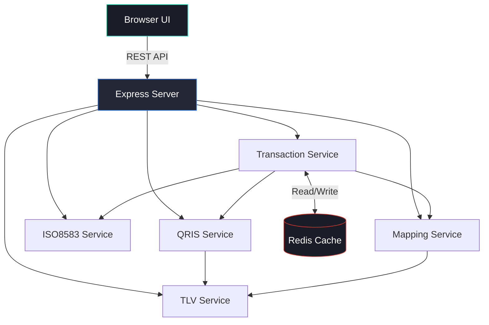

# ⚡ QRIS Payment Simulator

<p align="center">
  <strong>Full-Stack Simulator for QRIS MPM, CPM, TUNTAS & Cross Border Transactions</strong>
</p>

<p align="center">
  
  
  
  
  
</p>

---

## 📖 Overview

The **QRIS Payment Simulator** is a comprehensive, self-contained sandbox environment designed for payment developers, QA engineers, and system integrators. It emulates the complete lifecycle of Indonesian QR Code Payment Standard (QRIS) transactions—supporting both Merchant Presented Mode (MPM) and Consumer Presented Mode (CPM)—with full ISO 8583 messaging, TLV data parsing, and Redis-backed persistence.

Whether you are testing happy paths, edge cases, or end-to-end settlement (TUNTAS) and international routing (Cross Border), this simulator provides the tooling to generate, parse, map, and validate payment flows without needing live banking switches.

## ✨ Core Features

- **📱 QRIS Generation & Parsing**: Generate MPM (Static/Dynamic) and CPM QR strings with CRC-16 validation, or parse any existing QRIS string into structured TLV objects.
- **🔄 Dual Role Simulation**: Test both Acquirer (scanning/terminal side) and Issuer (bank/wallet side) workflows independently.
- **🏦 QRIS TUNTAS**: Simulate end-to-end settlement flows from Authorization (`0200`) → Financial Advice (`0220`) → Reconciliation (`0500`).
- **🌍 Cross Border Payments**: Simulate international QRIS transactions with dynamic FX rates, origin/settlement currency mapping, and Tag `91` sub-TLV generation.
- **📜 ISO 8583 Builder/Parser**: Construct raw ISO 8583 messages from MTI + Data Elements, or parse raw hex/ASCII strings back into readable JSON.
- **🔗 TLV ↔ ISO 8583 Mapping**: Bidirectional mapping engine to convert QRIS TLV tags to ISO 8583 Data Elements and vice-versa.
- **🎭 11 Mock Scenarios**: Built-in triggers for `Success`, `Pending`, `Failed`, `Insufficient Funds`, `Timeout`, `Suspected Fraud`, `System Error`, `Partial Approval`, `Duplicate`, `Not Permitted`, and `Invalid Amount`.
- **🗄️ Redis Integration**: All transactions and logs are persisted in Redis with automatic in-memory fallback if Redis is unavailable.
- **🧪 Full Test Suites**: Includes automated Playwright tests (API & UI) and a complete Postman/Newman collection.
- **🎨 Professional UI**: Dark-themed, single-page web dashboard for interactive testing.

---

## 🏗️ Architecture



---

## 🚀 Quick Start

### Option 1: Docker Compose (Recommended)

The fastest way to get started. Requires [Docker](https://www.docker.com/).

```bash
# Clone the repository
git clone <repo-url> && cd qris-simulator

# Start Redis and the Backend/Frontend
docker-compose up -d --build
```
Access the dashboard at **http://localhost:3000**

### Option 2: Automated Bash Script

Requires Node.js and npm installed locally.

```bash
chmod +x setup.sh
./setup.sh
```
The script will attempt to install/start Redis, install Node dependencies, and start the server.

### Option 3: Manual Setup

```bash
# 1. Start Redis (if available)
redis-server --daemonize yes

# 2. Install dependencies
cd backend
npm install

# 3. Start the server
npm start
```

---

## 📡 API Reference

The API is organized into four logical domains.

<details>
<summary><strong>📱 QRIS Operations</strong> (<code>/api/qris</code>)</summary>

| Method | Endpoint | Description |
|--------|----------|-------------|
| `POST` | `/api/qris/generate/mpm` | Generate Merchant Presented Mode QR |
| `POST` | `/api/qris/generate/cpm` | Generate Consumer Presented Mode QR |
| `POST` | `/api/qris/parse` | Parse any QRIS string to structured JSON |
| `POST` | `/api/qris/validate` | Validate QRIS CRC-16 checksum |
| `GET`  | `/api/qris/mock/merchants` | Get pre-configured MPM merchant data |
| `GET`  | `/api/qris/mock/consumers` | Get pre-configured CPM consumer data |
| `GET`  | `/api/qris/mock/scenarios` | List all mock action code scenarios |

</details>

<details>
<summary><strong>💰 Transaction Simulation</strong> (<code>/api/transaction</code>)</summary>

| Method | Endpoint | Description |
|--------|----------|-------------|
| `POST` | `/api/transaction/mpm/acquirer` | Simulate Acquirer MPM flow |
| `POST` | `/api/transaction/mpm/issuer` | Simulate Issuer MPM flow |
| `POST` | `/api/transaction/cpm/acquirer` | Simulate Acquirer CPM flow |
| `POST` | `/api/transaction/cpm/issuer` | Simulate Issuer CPM flow |
| `POST` | `/api/transaction/tuntas` | Run End-to-End Settlement flow |
| `POST` | `/api/transaction/cross-border` | Run International Cross Border flow |
| `GET`  | `/api/transaction/rrn/:rrn` | Query transaction by RRN |
| `GET`  | `/api/transaction/log` | Get recent transaction log |
| `DELETE`| `/api/transaction/clear` | Clear all Redis transaction data |

</details>

<details>
<summary><strong>📜 ISO 8583 Operations</strong> (<code>/api/iso8583</code>)</summary>

| Method | Endpoint | Description |
|--------|----------|-------------|
| `POST` | `/api/iso8583/build` | Build raw ISO 8583 from MTI & Fields |
| `POST` | `/api/iso8583/parse` | Parse raw ISO 8583 string |
| `POST` | `/api/iso8583/qris-request` | Build QRIS-specific ISO message types |
| `GET`  | `/api/iso8583/reference/mti` | MTI reference data |
| `GET`  | `/api/iso8583/reference/action-codes`| Action codes & descriptions |

</details>

<details>
<summary><strong>🔗 TLV & Mapping Operations</strong> (<code>/api/tlv</code>)</summary>

| Method | Endpoint | Description |
|--------|----------|-------------|
| `POST` | `/api/tlv/encode` | Encode single Tag-Length-Value |
| `POST` | `/api/tlv/decode` | Decode flat TLV string |
| `POST` | `/api/tlv/decode-recursive` | Decode nested/recursive sub-TLVs |
| `POST` | `/api/tlv/map-to-iso` | Map QRIS TLV tags → ISO 8583 Data Elements |
| `POST` | `/api/tlv/map-to-tlv` | Map ISO 8583 Data Elements → QRIS TLV |
| `GET`  | `/api/tlv/mapping-reference` | Get the full mapping dictionary |

</details>

---

## 🔗 TLV ↔ ISO 8583 Mapping

The simulator includes a bidirectional mapping engine. Below is a summary of how standard QRIS TLV tags translate to ISO 8583 Data Elements.

| TLV Tag | Sub | TLV Description | ISO DE | Conversion Rule |
|---------|-----|-----------------|--------|-----------------|
| `26`    | `01`| Merchant PAN    | `DE 2` | Direct map      |
| `26`    | `02`| Merchant ID     | `DE 42`| Direct map      |
| `26`    | `09`| Terminal ID     | `DE 41`| Direct map      |
| `29`    | `01`| Consumer PAN   | `DE 2` | Direct map      |
| `53`    | -   | Txn Currency    | `DE 49`| Direct map      |
| `54`    | -   | Txn Amount      | `DE 4` | ×100, padded to 12 digits |
| `59`    | -   | Merchant Name   | `DE 43`| Card Acceptor Name |
| `62`    | -   | Additional Data | `DE 62`| Sub-TLV preserved |
| `91`    | -   | Cross Border    | `DE 48`| Packed into private use |

---

## 🎭 Mock Scenarios

Trigger specific ISO 8583 Action Codes by passing the `scenario` parameter in transaction APIs.

| Scenario Key | Action Code | Status | Description |
|--------------|-------------|--------|-------------|
| `success` | `00` | APPROVED | Normal successful transaction |
| `pending` | `91` | PENDING | Issuer inoperative / switch down |
| `failed` | `05` | DECLINED | General decline (Do Not Honor) |
| `insufficient` | `51` | DECLINED | Insufficient funds |
| `invalid_amount` | `13` | DECLINED | Invalid amount (e.g., 0) |
| `timeout` | `68` | TIMEOUT | Issuer response too late |
| `suspected_fraud` | `59` | DECLINED | Suspected fraud flag |
| `system_error` | `96` | ERROR | System malfunction |
| `partial_approved` | `10` | PARTIAL | Partial amount approved |
| `duplicate` | `94` | DECLINED | Duplicate transmission |
| `not_permitted` | `57` | DECLINED | Txn not permitted to cardholder |

---

## 🧪 Testing

### Playwright (API & UI)

```bash
cd tests/playwright
npm install
npx playwright install chromium

# Run headless tests
npx playwright test

# Open interactive UI
npx playwright test --ui
```

### Postman / Newman

Import the collection and environment from `tests/postman/` into Postman, or run via CLI:

```bash
npm install -g newman

newman run tests/postman/qris-simulator.postman_collection.json \
  --environment tests/postman/qris-simulator.postman_environment.json
```

---

## 📐 Sequence Diagrams

PlantUML sources are located in `docs/sequence/`. You can render them using the [PlantUML Web Server](https://www.plantuml.com/plantuml/uml) or VS Code extensions.

| Diagram | File | Flow Description |
|---------|------|------------------|
| **MPM** | `mpm-flow.puml` | Customer scans Merchant QR → Acquirer → Switch → Issuer (Includes timeout & reversal alt-blocks) |
| **CPM** | `cpm-flow.puml` | Merchant scans Customer QR → POS → Acquirer → Issuer |
| **TUNTAS** | `tuntas-flow.puml` | Auth → Financial Advice → End-of-Day Clearing & Settlement |
| **Cross Border** | `crossborder-flow.puml` | Origin Acquirer → FX Gateway → Destination Issuer |

---

## 🗄️ Redis Data Model

All state is persisted in Redis. If Redis is unavailable, the system gracefully degrades to an in-memory store.

| Redis Key | Type | TTL | Description |
|-----------|------|-----|-------------|
| `txn:{rrn}` | String (JSON) | 24h | Individual transaction details |
| `transactions` | Hash | - | All transactions (Key = Txn ID) |
| `transaction_log` | List | - | Chronological append-only log |

---

## 📁 Project Structure

```
qris-simulator/
├── backend/
│   ├── src/
│   │   ├── index.js                 # Express entry point
│   │   ├── services/
│   │   │   ├── redis.js             # Redis wrapper + in-memory fallback
│   │   │   ├── tlv.js               # TLV encode/decode/recursive
│   │   │   ├── qris.js              # MPM/CPM generator & parser
│   │   │   ├── iso8583.js           # ISO8583 message builder/parser
│   │   │   ├── mapping.js           # Bidirectional TLV ↔ ISO8583
│   │   │   └── transaction.js       # Flow orchestrator (MPM/CPM/Tuntas/CB)
│   │   ├── routes/                  # Express route controllers
│   │   └── mock/data.js             # Mock merchants, consumers, scenarios
│   ├── Dockerfile
│   └── package.json
├── frontend/
│   ├── index.html                   # Dark-themed SPA
│   ├── css/style.css
│   └── js/app.js
├── tests/
│   ├── playwright/                  # API & E2E UI tests
│   └── postman/                     # Newman/Postman collection + env
├── docs/
│   └── sequence/                    # PlantUML diagrams
├── docker-compose.yml               # Redis + App orchestration
├── setup.sh                         # Bash setup script
└── README.md
```

---

## 📜 License

Distributed under the MIT License. See `LICENSE` for more information.

> **⚠️ Disclaimer:** This project is built strictly for simulation, testing, and educational purposes. It is not intended for processing live financial transactions.
