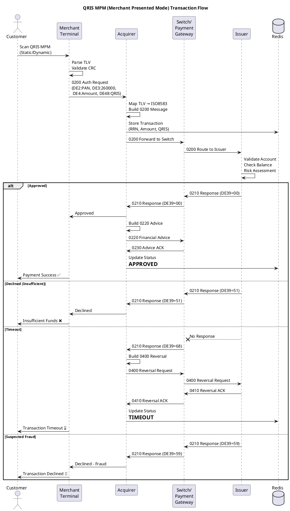
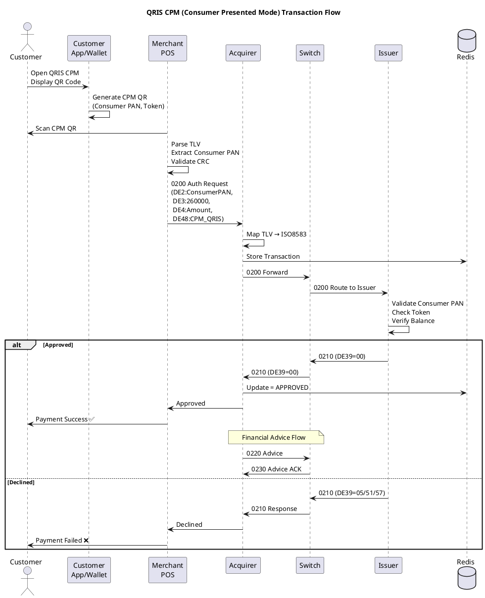
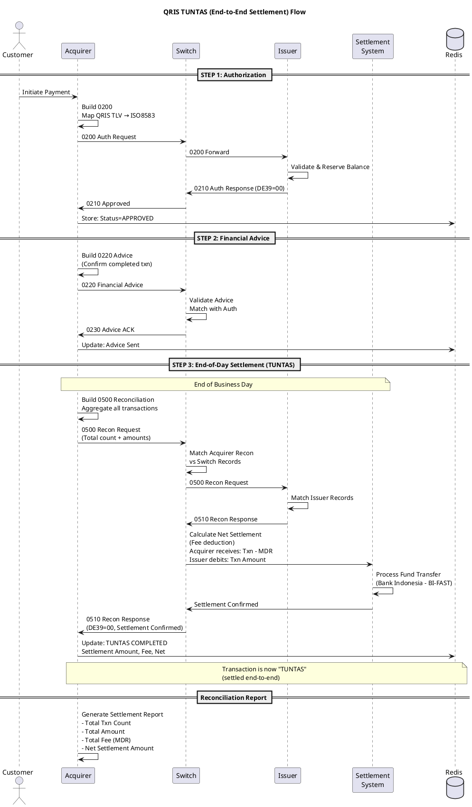
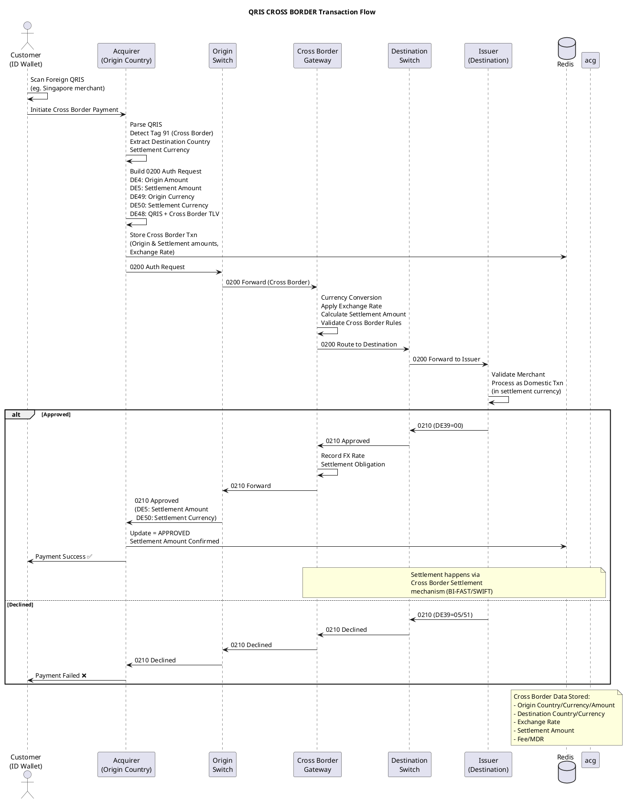

```javascript
/**
 * Mock data for all QRIS simulation scenarios
 */

const MPM_MERCHANTS = [
  {
    id: 'MPM-SUCCESS',
    label: 'Warung Kopi Nusantara (Static QR)',
    merchantPan:  '9360000100000001',
    merchantId:   '1234567890123',
    merchantName: 'WARUNG KOPI NUSANTARA',
    merchantCity: 'JAKARTA',
    countryCode:  'ID',
    currency:     '360',
    merchantCriteria: 'U',
    terminalId:   'TERM0001',
  },
  {
    id: 'MPM-DYNAMIC',
    label: 'Toko Elektronik Maju (Dynamic QR)',
    merchantPan:  '9360000200000002',
    merchantId:   '2345678901234',
    merchantName: 'TOKO ELEKTRONIK MAJU',
    merchantCity: 'BANDUNG',
    countryCode:  'ID',
    currency:     '360',
    merchantCriteria: 'U',
    terminalId:   'TERM0002',
  },
  {
    id: 'MPM-AGGREGATOR',
    label: 'GoFood Merchant (Aggregator)',
    merchantPan:  '9360000300000003',
    merchantId:   '3456789012345',
    merchantName: 'BAKSO PAK KUMIS',
    merchantCity: 'SURABAYA',
    countryCode:  'ID',
    currency:     '360',
    merchantCriteria: 'U',
    terminalId:   'GFOOD001',
  },
];

const CPM_CONSUMERS = [
  {
    id: 'CPM-SUCCESS',
    label: 'Ahmad Rizky (Active Card)',
    consumerPan:  '9360001000000001',
    consumerName: 'AHMAD RIZKY',
    consumerCity: 'JAKARTA',
    countryCode:  'ID',
    currency:     '360',
    token:        'TK00000001',
    cardExpiry:   '2512',
  },
  {
    id: 'CPM-INSUFFICIENT',
    label: 'Siti Nurhaliza (Low Balance)',
    consumerPan:  '9360001000000002',
    consumerName: 'SITI NURHALIZA',
    consumerCity: 'BANDUNG',
    countryCode:  'ID',
    currency:     '360',
    token:        'TK00000002',
    cardExpiry:   '2606',
  },
  {
    id: 'CPM-EXPIRED',
    label: 'Budi Santoso (Expired Card)',
    consumerPan:  '9360001000000003',
    consumerName: 'BUDI SANTOSO',
    consumerCity: 'SEMARANG',
    countryCode:  'ID',
    currency:     '360',
    token:        'TK00000003',
    cardExpiry:   '2212',
  },
];

const CROSS_BORDER_MERCHANTS = [
  {
    id: 'CB-SG-01',
    label: 'Singapore Souvenir Shop',
    merchantPan:  '9360005000000001',
    merchantId:   'SG1234567890',
    merchantName: 'SINGAPORE SOUVENIR',
    merchantCity: 'SINGAPORE',
    countryCode:  'SG',
    originCurrency: '702',
    settlementCurrency: '360',
    exchangeRate: 11500,
  },
  {
    id: 'CB-MY-01',
    label: 'Malaysia Electronics',
    merchantPan:  '9360005000000002',
    merchantId:   'MY1234567890',
    merchantName: 'MALAYSIA ELECTRONICS',
    merchantCity: 'KUALA LUMPUR',
    countryCode:  'MY',
    originCurrency: '458',
    settlementCurrency: '360',
    exchangeRate: 3200,
  },
  {
    id: 'CB-TH-01',
    label: 'Thai Restaurant Bangkok',
    merchantPan:  '9360005000000003',
    merchantId:   'TH1234567890',
    merchantName: 'THAI RESTAURANT BKK',
    merchantCity: 'BANGKOK',
    countryCode:  'TH',
    originCurrency: '764',
    settlementCurrency: '360',
    exchangeRate: 1000,
  },
];

const SCENARIOS = [
  { id: 'success',          name: 'Success / Approved',               actionCode: '00', status: 'APPROVED',  amount: 25000,   description: 'Normal successful transaction' },
  { id: 'pending',          name: 'Pending / Timeout at Issuer',      actionCode: '91', status: 'PENDING',   amount: 5500000,  description: 'Issuer inoperative, pending resolution' },
  { id: 'failed',           name: 'Failed / Do Not Honor',            actionCode: '05', status: 'DECLINED',  amount: 75000,    description: 'General decline from issuer' },
  { id: 'invalid_amount',   name: 'Invalid Amount',                   actionCode: '13', status: 'DECLINED',  amount: 0,        description: 'Zero or invalid amount' },
  { id: 'insufficient',     name: 'Insufficient Funds',               actionCode: '51', status: 'DECLINED',  amount: 50000000, description: 'Cardholder has insufficient balance' },
  { id: 'timeout',          name: 'Timeout / Response Too Late',      actionCode: '68', status: 'TIMEOUT',   amount: 100000,   description: 'Issuer did not respond in time' },
  { id: 'suspected_fraud',  name: 'Suspected Fraud',                  actionCode: '59', status: 'DECLINED',  amount: 15000000, description: 'Flagged as suspected fraudulent' },
  { id: 'system_error',     name: 'System Error',                     actionCode: '96', status: 'ERROR',     amount: 50000,    description: 'System malfunction at switch/issuer' },
  { id: 'partial_approved', name: 'Partial Approval',                 actionCode: '10', status: 'PARTIAL',   amount: 100000,   description: 'Only partial amount approved' },
  { id: 'duplicate',        name: 'Duplicate Transaction',            actionCode: '94', status: 'DECLINED',  amount: 25000,    description: 'Duplicate transmission detected' },
  { id: 'not_permitted',    name: 'Transaction Not Permitted',        actionCode: '57', status: 'DECLINED',  amount: 300000,   description: 'Transaction not permitted to cardholder' },
];

const TUNTAS_FLOW = {
  name: 'QRIS TUNTAS (End-to-End Settlement)',
  description: 'Complete flow from authorization through financial advice to settlement',
  steps: [
    { step: 1, name: 'Authorization Request',  mti: '0200', description: 'Acquirer sends purchase request to Switch' },
    { step: 2, name: 'Authorization Response',  mti: '0210', description: 'Issuer responds via Switch to Acquirer' },
    { step: 3, name: 'Financial Advice',        mti: '0220', description: 'Acquirer sends advice after successful auth' },
    { step: 4, name: 'Financial Advice Response',mti: '0230', description: 'Switch acknowledges the advice' },
    { step: 5, name: 'Settlement',              mti: '0500', description: 'End-of-day batch settlement (Tuntas)' },
    { step: 6, name: 'Settlement Response',     mti: '0510', description: 'Settlement confirmed, funds cleared' },
  ],
};

const ISO8583_SAMPLES = {
  purchaseRequest: {
    mti: '0200',
    description: 'QRIS Purchase Request (MPM/CPM)',
    fields: {
      2: '9360000100000001',
      3: '260000',
      4: '0000000025000',
      7: '231215143000',
      11: '000001',
      12: '143000',
      13: '1215',
      22: '022',
      25: '00',
      32: '0001',
      33: '0001',
      37: 'ABC123456789',
      41: 'TERM0001',
      42: 'MERCHANT001    ',
      43: 'WARUNG KOPI NUSANTARA       JAKARTA          ',
      48: '00020101021226000010QRIS0101936000010000000101021234567890123',
      49: '360',
    },
  },
  purchaseResponse: {
    mti: '0210',
    description: 'QRIS Purchase Response (Approved)',
    fields: {
      2: '9360000100000001',
      3: '260000',
      4: '0000000025000',
      7: '231215143000',
      11: '000001',
      12: '143000',
      13: '1215',
      32: '0001',
      33: '0001',
      37: 'ABC123456789',
      39: '00',
      41: 'TERM0001',
      42: 'MERCHANT001    ',
      43: 'WARUNG KOPI NUSANTARA       JAKARTA          ',
      49: '360',
    },
  },
  reversalRequest: {
    mti: '0400',
    description: 'Reversal Request (Timeout scenario)',
    fields: {
      2: '9360000100000001',
      3: '260000',
      4: '0000000025000',
      7: '231215143000',
      11: '000001',
      12: '143000',
      13: '1215',
      22: '022',
      25: '00',
      32: '0001',
      37: 'ABC123456789',
      41: 'TERM0001',
      42: 'MERCHANT001    ',
      49: '360',
    },
  },
  networkManagement: {
    mti: '0800',
    description: 'Network Management Sign-On',
    fields: {
      7: '231215143000',
      11: '000001',
      32: '0001',
      41: 'TERM0001',
      42: 'MERCHANT001    ',
    },
  },
};

const TLV_SAMPLES = {
  mpmStatic: '00020101021126600010QRIS0101936000010000000101021234567890123031U5204581253033605802ID5920WARUNG KOPI NUSANTARA6013JAKARTA63041234',
  mpmDynamic: '00020101021226600010QRIS010193600002000000210202345678901234031U540500010.0053033605802ID5918TOKO ELEKTRONIK MAJU6010BANDUNG6304ABCD',
  cpm:        '00020101021229600008QRISCPM01019360001000000010208TK0000000103251253033605802ID5912AHMAD RIZKY6013JAKARTA6304EFGH',
  crossBorder:'00020101021226600010QRIS0101936000050000001102SG1234567890031U54050000100.0053037025802SG5918SINGAPORE SOUVENIR6010SINGAPORE91260002ID01360020706304IJKL',
};

module.exports = {
  MPM_MERCHANTS,
  CPM_CONSUMERS,
  CROSS_BORDER_MERCHANTS,
  SCENARIOS,
  TUNTAS_FLOW,
  ISO8583_SAMPLES,
  TLV_SAMPLES,
};
```

---

## `backend/src/routes/qris.js`

```javascript
const express = require('express');
const QRIS = require('../services/qris');
const TLV  = require('../services/tlv');
const Mock = require('../mock/data');

const router = express.Router();

// Generate MPM QR
router.post('/generate/mpm', (req, res) => {
  try {
    const qris = QRIS.generateMPM(req.body);
    const parsed = QRIS.parse(qris);
    res.json({ success: true, qrisString: qris, parsed });
  } catch (e) { res.status(400).json({ success: false, error: e.message }); }
});

// Generate CPM QR
router.post('/generate/cpm', (req, res) => {
  try {
    const qris = QRIS.generateCPM(req.body);
    const parsed = QRIS.parse(qris);
    res.json({ success: true, qrisString: qris, parsed });
  } catch (e) { res.status(400).json({ success: false, error: e.message }); }
});

// Parse any QRIS string
router.post('/parse', (req, res) => {
  try {
    const parsed = QRIS.parse(req.body.qrisString);
    res.json({ success: true, parsed });
  } catch (e) { res.status(400).json({ success: false, error: e.message }); }
});

// Validate CRC
router.post('/validate', (req, res) => {
  try {
    const parsed = QRIS.parse(req.body.qrisString);
    res.json({ success: true, valid: parsed.valid, crcExpected: parsed.crcExpected, crcActual: parsed.crcActual });
  } catch (e) { res.status(400).json({ success: false, error: e.message }); }
});

// Get mock data
router.get('/mock/merchants', (req, res) => res.json(Mock.MPM_MERCHANTS));
router.get('/mock/consumers', (req, res) => res.json(Mock.CPM_CONSUMERS));
router.get('/mock/cross-border', (req, res) => res.json(Mock.CROSS_BORDER_MERCHANTS));
router.get('/mock/scenarios', (req, res) => res.json(Mock.SCENARIOS));
router.get('/mock/tlv-samples', (req, res) => res.json(Mock.TLV_SAMPLES));

module.exports = router;
```

---

## `backend/src/routes/iso8583.js`

```javascript
const express = require('express');
const { ISO8583Service, MTI, PROC_CODE, ACTION_CODE, ACTION_DESC, FIELD_DEF } = require('../services/iso8583');

const router = express.Router();

// Build ISO8583 message
router.post('/build', (req, res) => {
  try {
    const { mti, fields } = req.body;
    const raw = ISO8583Service.buildMessage(mti, fields);
    res.json({ success: true, mti, fields, raw });
  } catch (e) { res.status(400).json({ success: false, error: e.message }); }
});

// Parse ISO8583 message
router.post('/parse', (req, res) => {
  try {
    const parsed = ISO8583Service.parseMessage(req.body.raw);
    res.json({ success: true, parsed });
  } catch (e) { res.status(400).json({ success: false, error: e.message }); }
});

// Build QRIS-specific ISO message
router.post('/qris-request', (req, res) => {
  try {
    const { type, params } = req.body;
    const result = ISO8583Service.buildQRISRequest(type, params);
    res.json({ success: true, result });
  } catch (e) { res.status(400).json({ success: false, error: e.message }); }
});

// Reference data
router.get('/reference/mti', (req, res) => res.json(MTI));
router.get('/reference/proc-codes', (req, res) => res.json(PROC_CODE));
router.get('/reference/action-codes', (req, res) => res.json({ codes: ACTION_CODE, descriptions: ACTION_DESC }));
router.get('/reference/fields', (req, res) => res.json(FIELD_DEF));

module.exports = router;
```

---

## `backend/src/routes/tlv.js`

```javascript
const express = require('express');
const TLV     = require('../services/tlv');
const Mapping = require('../services/mapping');

const router = express.Router();

// Encode TLV
router.post('/encode', (req, res) => {
  try {
    const { tag, value } = req.body;
    const encoded = TLV.encode(tag, value);
    res.json({ success: true, tag, value, encoded });
  } catch (e) { res.status(400).json({ success: false, error: e.message }); }
});

// Decode TLV
router.post('/decode', (req, res) => {
  try {
    const decoded = TLV.decode(req.body.tlvString);
    res.json({ success: true, decoded });
  } catch (e) { res.status(400).json({ success: false, error: e.message }); }
});

// Build from tag array
router.post('/build', (req, res) => {
  try {
    const built = TLV.build(req.body.tags);
    res.json({ success: true, tlvString: built });
  } catch (e) { res.status(400).json({ success: false, error: e.message }); }
});

// Recursive decode
router.post('/decode-recursive', (req, res) => {
  try {
    const decoded = TLV.decodeRecursive(req.body.tlvString);
    res.json({ success: true, decoded });
  } catch (e) { res.status(400).json({ success: false, error: e.message }); }
});

// Map TLV → ISO8583
router.post('/map-to-iso', (req, res) => {
  try {
    const QRIS = require('../services/qris');
    const parsed = QRIS.parse(req.body.qrisString);
    const mapping = Mapping.mapTLVToISO(parsed);
    res.json({ success: true, mapping });
  } catch (e) { res.status(400).json({ success: false, error: e.message }); }
});

// Map ISO8583 → TLV
router.post('/map-to-tlv', (req, res) => {
  try {
    const mapping = Mapping.mapISOToTLV(req.body.fields);
    res.json({ success: true, mapping });
  } catch (e) { res.status(400).json({ success: false, error: e.message }); }
});

// Get mapping reference
router.get('/mapping-reference', (req, res) => res.json(Mapping.getReference()));

module.exports = router;
```

---

## `backend/src/routes/transaction.js`

```javascript
const express = require('express');
const Txn     = require('../services/transaction');

const router = express.Router();

// MPM Acquirer
router.post('/mpm/acquirer', async (req, res) => {
  try { res.json({ success: true, result: await Txn.mpmAcquirer(req.body) }); }
  catch (e) { res.status(400).json({ success: false, error: e.message }); }
});

// MPM Issuer
router.post('/mpm/issuer', async (req, res) => {
  try { res.json({ success: true, result: await Txn.mpmIssuer(req.body) }); }
  catch (e) { res.status(400).json({ success: false, error: e.message }); }
});

// CPM Acquirer
router.post('/cpm/acquirer', async (req, res) => {
  try { res.json({ success: true, result: await Txn.cpmAcquirer(req.body) }); }
  catch (e) { res.status(400).json({ success: false, error: e.message }); }
});

// CPM Issuer
router.post('/cpm/issuer', async (req, res) => {
  try { res.json({ success: true, result: await Txn.cpmIssuer(req.body) }); }
  catch (e) { res.status(400).json({ success: false, error: e.message }); }
});

// QRIS Tuntas
router.post('/tuntas', async (req, res) => {
  try { res.json({ success: true, result: await Txn.tuntas(req.body) }); }
  catch (e) { res.status(400).json({ success: false, error: e.message }); }
});

// Cross Border
router.post('/cross-border', async (req, res) => {
  try { res.json({ success: true, result: await Txn.crossBorder(req.body) }); }
  catch (e) { res.status(400).json({ success: false, error: e.message }); }
});

// Query
router.get('/rrn/:rrn',       async (req, res) => { res.json({ success: true, result: await Txn.getByRRN(req.params.rrn) }); });
router.get('/all',            async (req, res) => { res.json({ success: true, result: await Txn.getAll() }); });
router.get('/log',            async (req, res) => { res.json({ success: true, result: await Txn.getLog(parseInt(req.query.limit)||50) }); });
router.delete('/clear',       async (req, res) => { res.json({ success: true, result: await Txn.clear() }); });

module.exports = router;
```

---

## `backend/src/index.js`

```javascript
require('dotenv').config();
const express = require('express');
const cors    = require('cors');
const path    = require('path');
const Redis   = require('./services/redis');

const app  = express();
const PORT = process.env.PORT || 3000;

app.use(cors());
app.use(express.json({ limit: '10mb' }));
app.use(express.urlencoded({ extended: true }));
app.use(express.static(path.join(__dirname, '../../frontend')));

// Routes
app.use('/api/qris',        require('./routes/qris'));
app.use('/api/iso8583',     require('./routes/iso8583'));
app.use('/api/tlv',         require('./routes/tlv'));
app.use('/api/transaction', require('./routes/transaction'));

// Health check
app.get('/api/health', async (req, res) => {
  res.json({
    status: 'OK',
    timestamp: new Date().toISOString(),
    redis: Redis.isConnected() ? 'CONNECTED' : 'IN-MEMORY FALLBACK',
    version: '1.0.0',
  });
});

// SPA fallback
app.get('*', (req, res) => {
  res.sendFile(path.join(__dirname, '../../frontend/index.html'));
});

// Start
async function start() {
  await Redis.connect();
  app.listen(PORT, () => {
    console.log(`
  ╔══════════════════════════════════════════════════╗
  ║         QRIS SIMULATOR - Fullstack v1.0          ║
  ╠══════════════════════════════════════════════════╣
  ║  Frontend  : http://localhost:${PORT}              ║
  ║  API       : http://localhost:${PORT}/api           ║
  ║  Redis     : ${Redis.isConnected() ? 'CONNECTED' : 'IN-MEMORY FALLBACK'}                         ║
  ╚══════════════════════════════════════════════════╝
    `);
  });
}

start().catch(err => { console.error('Failed to start:', err); process.exit(1); });
```

---

## `frontend/index.html`

```html
<!DOCTYPE html>
<html lang="en">
<head>
  <meta charset="UTF-8">
  <meta name="viewport" content="width=device-width, initial-scale=1.0">
  <title>QRIS Simulator</title>
  <link rel="stylesheet" href="css/style.css">
</head>
<body>
  <header>
    <div class="header-inner">
      <h1>⚡ QRIS Simulator</h1>
      <div class="header-meta">
        <span id="redisStatus" class="badge">Connecting…</span>
        <span class="badge secondary">v1.0</span>
      </div>
    </div>
  </header>

  <nav class="tabs">
    <button class="tab active" data-tab="generator">QR Generator</button>
    <button class="tab" data-tab="parser">QR Parser</button>
    <button class="tab" data-tab="iso8583">ISO8583</button>
    <button class="tab" data-tab="mapping">TLV↔ISO Map</button>
    <button class="tab" data-tab="mpm">MPM Txn</button>
    <button class="tab" data-tab="cpm">CPM Txn</button>
    <button class="tab" data-tab="tuntas">Tuntas</button>
    <button class="tab" data-tab="crossborder">Cross Border</button>
    <button class="tab" data-tab="log">Txn Log</button>
  </nav>

  <main>
    <!-- ─── QR Generator ──────────────────────── -->
    <section id="tab-generator" class="tab-content active">
      <div class="card">
        <h2>Generate QRIS String</h2>
        <div class="form-grid">
          <div class="field">
            <label>Mode</label>
            <select id="genMode"><option value="mpm">MPM (Merchant Presented)</option><option value="cpm">CPM (Consumer Presented)</option></select>
          </div>
          <div class="field">
            <label>PAN</label>
            <input id="genPan" value="9360000100000001" placeholder="9360...">
          </div>
          <div class="field">
            <label>Merchant / Consumer ID</label>
            <input id="genMerchId" value="1234567890123">
          </div>
          <div class="field">
            <label>Name</label>
            <input id="genName" value="WARUNG KOPI NUSANTARA">
          </div>
          <div class="field">
            <label>City</label>
            <input id="genCity" value="JAKARTA">
          </div>
          <div class="field">
            <label>Amount (0 = static)</label>
            <input id="genAmount" type="number" value="25000">
          </div>
          <div class="field">
            <label>Currency</label>
            <select id="genCurrency"><option value="360">IDR (360)</option><option value="702">SGD (702)</option><option value="458">MYR (458)</option><option value="764">THB (764)</option></select>
          </div>
          <div class="field">
            <label>Country</label>
            <input id="genCountry" value="ID" maxlength="2">
          </div>
          <div class="field">
            <label>Terminal ID</label>
            <input id="genTerminal" value="TERM0001">
          </div>
          <div class="field">
            <label>Criteria</label>
            <select id="genCriteria"><option value="U">U - Usaha Mikro</option><option value="M">M - Menengah</option><option value="L">L - Large</option></select>
          </div>
        </div>
        <button class="btn primary" onclick="generateQR()">Generate QRIS</button>
        <div id="genResult" class="result-box" style="display:none"></div>
      </div>
    </section>

    <!-- ─── QR Parser ──────────────────────────── -->
    <section id="tab-parser" class="tab-content">
      <div class="card">
        <h2>Parse QRIS String</h2>
        <div class="field">
          <label>QRIS String</label>
          <textarea id="parseInput" rows="4" placeholder="00020101021126..."></textarea>
        </div>
        <div class="btn-row">
          <button class="btn primary" onclick="parseQR()">Parse</button>
          <button class="btn" onclick="loadSampleMPM()">Load MPM Sample</button>
          <button class="btn" onclick="loadSampleCPM()">Load CPM Sample</button>
        </div>
        <div id="parseResult" class="result-box" style="display:none"></div>
      </div>
    </section>

    <!-- ─── ISO8583 ────────────────────────────── -->
    <section id="tab-iso8583" class="tab-content">
      <div class="card">
        <h2>ISO8583 Builder / Parser</h2>
        <div class="split">
          <div class="half">
            <h3>Build Message</h3>
            <div class="field"><label>MTI</label><select id="isoMti">
              <option value="0200">0200 - Auth Request</option>
              <option value="0210">0210 - Auth Response</option>
              <option value="0220">0220 - Advice Request</option>
              <option value="0230">0230 - Advice Response</option>
              <option value="0400">0400 - Reversal Request</option>
              <option value="0410">0410 - Reversal Response</option>
              <option value="0500">0500 - Reconciliation Request</option>
              <option value="0510">0510 - Reconciliation Response</option>
              <option value="0800">0800 - Network Mgmt Request</option>
              <option value="0810">0810 - Network Mgmt Response</option>
            </select></div>
            <div class="field"><label>PAN (DE2)</label><input id="isoPAN" value="9360000100000001"></div>
            <div class="field"><label>Processing Code (DE3)</label><select id="isoProcCode">
              <option value="260000">260000 - Purchase</option><option value="200000">200000 - Refund</option>
              <option value="310000">310000 - Inquiry</option><option value="360000">360000 - Payment</option>
            </select></div>
            <div class="field"><label>Amount (DE4)</label><input id="isoAmount" type="number" value="25000"></div>
            <div class="field"><label>STAN (DE11)</label><input id="isoSTAN" value="000001"></div>
            <div class="field"><label>RRN (DE37)</label><input id="isoRRN" value="ABC123456789"></div>
            <div class="field"><label>Terminal ID (DE41)</label><input id="isoTerminal" value="TERM0001"></div>
            <div class="field"><label>Merchant ID (DE42)</label><input id="isoMerchId" value="MERCHANT001"></div>
            <div class="field"><label>Currency (DE49)</label><select id="isoCurrency"><option value="360">IDR 360</option><option value="702">SGD 702</option></select></div>
            <div class="field"><label>Action Code (DE39) - for responses</label><select id="isoActionCode">
              <option value="00">00 - Approved</option><option value="05">05 - Do Not Honor</option>
              <option value="13">13 - Invalid Amount</option><option value="51">51 - Insufficient Funds</option>
              <option value="68">68 - Timeout</option><option value="91">91 - Issuer Inop</option><option value="96">96 - System Error</option>
            </select></div>
            <button class="btn primary" onclick="buildISO()">Build ISO8583</button>
          </div>
          <div class="half">
            <h3>Parse Message</h3>
            <div class="field"><label>Raw ISO8583</label><textarea id="isoParseInput" rows="5"></textarea></div>
            <button class="btn" onclick="parseISO()">Parse</button>
          </div>
        </div>
        <div id="isoResult" class="result-box" style="display:none"></div>
      </div>
    </section>

    <!-- ─── TLV ↔ ISO Mapping ─────────────────── -->
    <section id="tab-mapping" class="tab-content">
      <div class="card">
        <h2>TLV ↔ ISO8583 Mapping</h2>
        <div class="field"><label>QRIS String (for TLV→ISO)</label><textarea id="mapQris" rows="3" placeholder="00020101021126..."></textarea></div>
        <div class="btn-row">
          <button class="btn primary" onclick="mapTLVtoISO()">TLV → ISO8583</button>
          <button class="btn" onclick="mapISOtoTLV()">ISO8583 → TLV</button>
          <button class="btn secondary" onclick="loadMappingRef()">Reference Table</button>
        </div>
        <div id="mapResult" class="result-box" style="display:none"></div>
      </div>
    </section>

    <!-- ─── MPM Transaction ────────────────────── -->
    <section id="tab-mpm" class="tab-content">
      <div class="card">
        <h2>MPM Transaction</h2>
        <div class="role-toggle">
          <button class="btn active" id="mpmRoleAcq" onclick="setRole('mpm','acquirer')">Acquirer</button>
          <button class="btn" id="mpmRoleIss" onclick="setRole('mpm','issuer')">Issuer</button>
        </div>
        <div id="mpmAcqForm">
          <div class="form-grid">
            <div class="field"><label>QRIS String</label><textarea id="mpmQris" rows="3"></textarea></div>
            <div class="field"><label>Amount</label><input id="mpmAmount" type="number" value="25000"></div>
            <div class="field"><label>Scenario</label><select id="mpmScenario">
              <option value="success">✅ Success</option><option value="pending">⏳ Pending</option>
              <option value="failed">❌ Failed</option><option value="insufficient">💸 Insufficient</option>
              <option value="timeout">⌛ Timeout</option><option value="suspected_fraud">🚨 Fraud</option>
              <option value="system_error">⚙️ System Error</option><option value="duplicate">🔄 Duplicate</option>
            </select></div>
            <div class="field"><label>PAN (override)</label><input id="mpmPan" value="9360000100000001"></div>
            <div class="field"><label>Terminal ID</label><input id="mpmTerminal" value="TERM0001"></div>
            <div class="field"><label>Acq Institution</label><input id="mpmAcqInst" value="0001"></div>
          </div>
          <div class="btn-row">
            <button class="btn primary" onclick="submitMPM('acquirer')">Submit as Acquirer</button>
            <button class="btn" onclick="generateMPMForTxn()">Generate QR First</button>
          </div>
        </div>
        <div id="mpmIssForm" style="display:none">
          <div class="form-grid">
            <div class="field"><label>Amount</label><input id="mpmIssAmount" type="number" value="25000"></div>
            <div class="field"><label>Scenario</label><select id="mpmIssScenario"><option value="success">✅ Success</option><option value="pending">⏳ Pending</option><option value="failed">❌ Failed</option><option value="insufficient">💸 Insufficient</option><option value="timeout">⌛ Timeout</option></select></div>
            <div class="field"><label>RRN</label><input id="mpmIssRRN"></div>
            <div class="field"><label>PAN</label><input id="mpmIssPan" value="9360000100000001"></div>
            <div class="field"><label>Currency</label><input id="mpmIssCurrency" value="360"></div>
          </div>
          <button class="btn primary" onclick="submitMPM('issuer')">Submit as Issuer</button>
        </div>
        <div id="mpmResult" class="result-box" style="display:none"></div>
      </div>
    </section>

    <!-- ─── CPM Transaction ────────────────────── -->
    <section id="tab-cpm" class="tab-content">
      <div class="card">
        <h2>CPM Transaction</h2>
        <div class="role-toggle">
          <button class="btn active" id="cpmRoleAcq" onclick="setRole('cpm','acquirer')">Acquirer</button>
          <button class="btn" id="cpmRoleIss" onclick="setRole('cpm','issuer')">Issuer</button>
        </div>
        <div id="cpmAcqForm">
          <div class="form-grid">
            <div class="field"><label>QRIS String</label><textarea id="cpmQris" rows="3"></textarea></div>
            <div class="field"><label>Amount</label><input id="cpmAmount" type="number" value="50000"></div>
            <div class="field"><label>Scenario</label><select id="cpmScenario"><option value="success">✅ Success</option><option value="failed">❌ Failed</option><option value="insufficient">💸 Insufficient</option><option value="timeout">⌛ Timeout</option></select></div>
            <div class="field"><label>Merchant ID</label><input id="cpmMerchId" value="MERCHANT001"></div>
            <div class="field"><label>Terminal ID</label><input id="cpmTerminal" value="TERM0001"></div>
          </div>
          <div class="btn-row">
            <button class="btn primary" onclick="submitCPM('acquirer')">Submit as Acquirer</button>
            <button class="btn" onclick="generateCPMForTxn()">Generate QR First</button>
          </div>
        </div>
        <div id="cpmIssForm" style="display:none">
          <div class="form-grid">
            <div class="field"><label>Amount</label><input id="cpmIssAmount" type="number" value="50000"></div>
            <div class="field"><label>Scenario</label><select id="cpmIssScenario"><option value="success">✅ Success</option><option value="failed">❌ Failed</option><option value="insufficient">💸 Insufficient</option></select></div>
            <div class="field"><label>RRN</label><input id="cpmIssRRN"></div>
            <div class="field"><label>PAN</label><input id="cpmIssPan" value="9360001000000001"></div>
          </div>
          <button class="btn primary" onclick="submitCPM('issuer')">Submit as Issuer</button>
        </div>
        <div id="cpmResult" class="result-box" style="display:none"></div>
      </div>
    </section>

    <!-- ─── Tuntas ──────────────────────────────── -->
    <section id="tab-tuntas" class="tab-content">
      <div class="card">
        <h2>QRIS TUNTAS (End-to-End Settlement)</h2>
        <p class="desc">Complete authorization → advice → settlement flow</p>
        <div class="form-grid">
          <div class="field"><label>Amount</label><input id="tuntasAmount" type="number" value="25000"></div>
          <div class="field"><label>Scenario</label><select id="tuntasScenario"><option value="success">✅ Success (Full Tuntas)</option><option value="failed">❌ Failed at Auth</option><option value="pending">⏳ Pending</option><option value="system_error">⚙️ System Error</option></select></div>
          <div class="field"><label>PAN</label><input id="tuntasPan" value="9360000100000001"></div>
          <div class="field"><label>Merchant ID</label><input id="tuntasMerchId" value="MERCHANT001"></div>
          <div class="field"><label>Terminal ID</label><input id="tuntasTerminal" value="TERM0001"></div>
          <div class="field"><label>Currency</label><input id="tuntasCurrency" value="360"></div>
          <div class="field"><label>Fee (blank=0.7%)</label><input id="tuntasFee" placeholder="auto"></div>
        </div>
        <button class="btn primary large" onclick="submitTuntas()">Run TUNTAS Flow</button>
        <div id="tuntasResult" class="result-box" style="display:none"></div>
      </div>
    </section>

    <!-- ─── Cross Border ───────────────────────── -->
    <section id="tab-crossborder" class="tab-content">
      <div class="card">
        <h2>QRIS CROSS BORDER</h2>
        <p class="desc">Simulate international QRIS transaction with currency conversion</p>
        <div class="form-grid">
          <div class="field"><label>Amount (origin currency)</label><input id="cbAmount" type="number" value="100"></div>
          <div class="field"><label>Origin Country</label><select id="cbOriginCountry"><option value="SG">Singapore</option><option value="MY">Malaysia</option><option value="TH">Thailand</option></select></div>
          <div class="field"><label>Origin Currency</label><select id="cbOriginCcy"><option value="702">SGD (702)</option><option value="458">MYR (458)</option><option value="764">THB (764)</option></select></div>
          <div class="field"><label>Settlement Currency</label><input id="cbSettleCcy" value="360"></div>
          <div class="field"><label>Exchange Rate</label><input id="cbRate" value="11500"></div>
          <div class="field"><label>Scenario</label><select id="cbScenario"><option value="success">✅ Success</option><option value="failed">❌ Failed</option><option value="timeout">⌛ Timeout</option><option value="system_error">⚙️ System Error</option></select></div>
          <div class="field"><label>Merchant Name</label><input id="cbMerchName" value="SINGAPORE SOUVENIR"></div>
          <div class="field"><label>Merchant City</label><input id="cbMerchCity" value="SINGAPORE"></div>
        </div>
        <button class="btn primary large" onclick="submitCrossBorder()">Run Cross Border Flow</button>
        <div id="cbResult" class="result-box" style="display:none"></div>
      </div>
    </section>

    <!-- ─── Transaction Log ────────────────────── -->
    <section id="tab-log" class="tab-content">
      <div class="card">
        <h2>Transaction Log</h2>
        <div class="btn-row">
          <button class="btn" onclick="refreshLog()">Refresh</button>
          <button class="btn danger" onclick="clearLog()">Clear All</button>
        </div>
        <div id="logContent"><p class="muted">Loading…</p></div>
      </div>
    </section>
  </main>

  <script src="js/app.js"></script>
</body>
</html>
```

---

## `frontend/css/style.css`

```css
:root {
  --bg: #0f1117;
  --surface: #1a1d27;
  --surface2: #242836;
  --border: #2e3347;
  --text: #e4e6f0;
  --muted: #8b8fa3;
  --primary: #00d4aa;
  --primary-dim: #00a888;
  --danger: #ff4d6a;
  --warning: #ffb020;
  --info: #3b82f6;
  --success: #00d4aa;
  --radius: 8px;
  --mono: 'JetBrains Mono', 'Fira Code', 'Consolas', monospace;
  --sans: 'Inter', -apple-system, 'Segoe UI', sans-serif;
}
*, *::before, *::after { box-sizing: border-box; margin: 0; padding: 0; }
body { font-family: var(--sans); background: var(--bg); color: var(--text); line-height: 1.6; min-height: 100vh; }

/* Header */
header { background: var(--surface); border-bottom: 1px solid var(--border); padding: 16px 24px; }
.header-inner { max-width: 1400px; margin: 0 auto; display: flex; justify-content: space-between; align-items: center; }
header h1 { font-size: 1.4rem; font-weight: 700; color: var(--primary); letter-spacing: -0.5px; }
.header-meta { display: flex; gap: 8px; align-items: center; }
.badge { display: inline-flex; align-items: center; padding: 4px 12px; border-radius: 20px; font-size: 0.75rem; font-weight: 600; background: rgba(0,212,170,0.15); color: var(--primary); border: 1px solid rgba(0,212,170,0.3); }
.badge.secondary { background: rgba(139,143,163,0.15); color: var(--muted); border-color: rgba(139,143,163,0.3); }
.badge.danger { background: rgba(255,77,106,0.15); color: var(--danger); border-color: rgba(255,77,106,0.3); }

/* Tabs */
.tabs { display: flex; gap: 0; background: var(--surface); border-bottom: 1px solid var(--border); padding: 0 24px; overflow-x: auto; max-width: 100%; }
.tab { padding: 12px 20px; background: none; border: none; color: var(--muted); font-size: 0.85rem; font-weight: 500; cursor: pointer; border-bottom: 2px solid transparent; white-space: nowrap; transition: all 0.2s; }
.tab:hover { color: var(--text); background: rgba(255,255,255,0.03); }
.tab.active { color: var(--primary); border-bottom-color: var(--primary); background: rgba(0,212,170,0.05); }

/* Main */
main { max-width: 1400px; margin: 0 auto; padding: 24px; }
.tab-content { display: none; }
.tab-content.active { display: block; animation: fadeIn 0.3s; }
@keyframes fadeIn { from { opacity: 0; transform: translateY(8px); } to { opacity: 1; transform: translateY(0); } }

/* Cards */
.card { background: var(--surface); border: 1px solid var(--border); border-radius: var(--radius); padding: 24px; }
.card h2 { font-size: 1.2rem; margin-bottom: 20px; color: var(--primary); }
.card h3 { font-size: 1rem; margin-bottom: 12px; color: var(--text); }
.desc { color: var(--muted); font-size: 0.9rem; margin-bottom: 16px; }
.muted { color: var(--muted); }

/* Form */
.form-grid { display: grid; grid-template-columns: repeat(auto-fill, minmax(260px, 1fr)); gap: 16px; margin-bottom: 20px; }
.field { display: flex; flex-direction: column; gap: 6px; }
.field label { font-size: 0.8rem; font-weight: 600; color: var(--muted); text-transform: uppercase; letter-spacing: 0.5px; }
.field input, .field select, .field textarea {
  background: var(--surface2); border: 1px solid var(--border); border-radius: 6px;
  padding: 10px 12px; color: var(--text); font-size: 0.9rem; font-family: var(--sans);
  transition: border-color 0.2s;
}
.field input:focus, .field select:focus, .field textarea:focus { outline: none; border-color: var(--primary); }
.field textarea { font-family: var(--mono); font-size: 0.82rem; resize: vertical; }

/* Buttons */
.btn {
  display: inline-flex; align-items: center; padding: 10px 20px; border-radius: 6px; border: 1px solid var(--border);
  background: var(--surface2); color: var(--text); font-size: 0.85rem; font-weight: 600; cursor: pointer;
  transition: all 0.2s;
}
.btn:hover { background: var(--border); }
.btn.primary { background: var(--primary); color: #0f1117; border-color: var(--primary); }
.btn.primary:hover { background: var(--primary-dim); }
.btn.danger { background: rgba(255,77,106,0.15); color: var(--danger); border-color: rgba(255,77,106,0.3); }
.btn.danger:hover { background: rgba(255,77,106,0.25); }
.btn.large { padding: 14px 32px; font-size: 1rem; }
.btn-row { display: flex; gap: 10px; flex-wrap: wrap; margin-bottom: 16px; }

/* Role Toggle */
.role-toggle { display: flex; gap: 0; margin-bottom: 20px; border-radius: 6px; overflow: hidden; border: 1px solid var(--border); width: fit-content; }
.role-toggle .btn { border: none; border-radius: 0; }
.role-toggle .btn.active { background: var(--primary); color: #0f1117; }

/* Split */
.split { display: grid; grid-template-columns: 1fr 1fr; gap: 24px; }
@media (max-width: 900px) { .split { grid-template-columns: 1fr; } }

/* Result */
.result-box { margin-top: 20px; padding: 16px; background: var(--surface2); border: 1px solid var(--border); border-radius: 6px; overflow-x: auto; max-height: 600px; overflow-y: auto; }
.result-box pre { font-family: var(--mono); font-size: 0.8rem; white-space: pre-wrap; word-break: break-all; color: var(--text); }
.result-box .key { color: var(--primary); }
.result-box .str { color: #f0c674; }
.result-box .num { color: #81a2be; }
.result-box .bool { color: #b294bb; }

/* Status indicators */
.status-approved { color: var(--success); font-weight: 700; }
.status-declined { color: var(--danger); font-weight: 700; }
.status-pending  { color: var(--warning); font-weight: 700; }
.status-timeout  { color: var(--warning); font-weight: 700; }
.status-error    { color: var(--danger); font-weight: 700; }
.status-partial  { color: var(--info); font-weight: 700; }

/* Steps (Tuntas) */
.step-card { background: var(--surface); border: 1px solid var(--border); border-radius: 6px; padding: 16px; margin-bottom: 12px; }
.step-card .step-header { display: flex; justify-content: space-between; align-items: center; margin-bottom: 8px; }
.step-card .step-name { font-weight: 700; color: var(--primary); }
.step-card .step-mti { font-family: var(--mono); color: var(--warning); font-size: 0.85rem; }
.step-card pre { font-family: var(--mono); font-size: 0.78rem; background: var(--bg); padding: 8px; border-radius: 4px; overflow-x: auto; }

/* Table */
.table-wrap { overflow-x: auto; }
table { width: 100%; border-collapse: collapse; font-size: 0.85rem; }
th { background: var(--surface2); color: var(--muted); text-transform: uppercase; font-size: 0.75rem; letter-spacing: 0.5px; padding: 10px 12px; text-align: left; border-bottom: 1px solid var(--border); }
td { padding: 10px 12px; border-bottom: 1px solid var(--border); }
tr:hover td { background: rgba(255,255,255,0.02); }

/* ISO Field Table */
.iso-field { font-family: var(--mono); color: var(--primary); font-weight: 600; }
.iso-value { font-family: var(--mono); color: #f0c674; font-size: 0.82rem; }

/* QR display */
.qr-string { font-family: var(--mono); font-size: 0.82rem; background: var(--bg); padding: 12px; border-radius: 4px; word-break: break-all; border: 1px solid var(--border); }

/* Scrollbar */
::-webkit-scrollbar { width: 6px; height: 6px; }
::-webkit-scrollbar-track { background: var(--bg); }
::-webkit-scrollbar-thumb { background: var(--border); border-radius: 3px; }
::-webkit-scrollbar-thumb:hover { background: var(--muted); }
```

---

## `frontend/js/app.js`

```javascript
const API = '';

// ─── Utility ──────────────────────────────────────────────────
async function api(method, path, body) {
  const opts = { method, headers: { 'Content-Type': 'application/json' } };
  if (body) opts.body = JSON.stringify(body);
  const res = await fetch(`${API}/api${path}`, opts);
  return res.json();
}

function $(id) { return document.getElementById(id); }
function show(el) { el.style.display = 'block'; }
function hide(el) { el.style.display = 'none'; }
function fmtJSON(obj) { return syntaxHighlight(JSON.stringify(obj, null, 2)); }

function syntaxHighlight(json) {
  return json.replace(/("(\\u[a-zA-Z0-9]{4}|\\[^u]|[^\\"])*"(\s*:)?|\b(true|false|null)\b|-?\d+(?:\.\d*)?(?:[eE][+\-]?\d+)?)/g, function(match) {
    let cls = 'num';
    if (/^"/.test(match)) { cls = /:$/.test(match) ? 'key' : 'str'; }
    else if (/true|false/.test(match)) { cls = 'bool'; }
    return `<span class="${cls}">${match}</span>`;
  });
}

function statusClass(status) {
  const s = (status || '').toUpperCase();
  if (s === 'APPROVED') return 'status-approved';
  if (s === 'DECLINED') return 'status-declined';
  if (s === 'PENDING') return 'status-pending';
  if (s === 'TIMEOUT') return 'status-timeout';
  if (s === 'ERROR') return 'status-error';
  if (s === 'PARTIAL') return 'status-partial';
  return '';
}

// ─── Tabs ─────────────────────────────────────────────────────
document.querySelectorAll('.tab').forEach(tab => {
  tab.addEventListener('click', () => {
    document.querySelectorAll('.tab').forEach(t => t.classList.remove('active'));
    document.querySelectorAll('.tab-content').forEach(c => c.classList.remove('active'));
    tab.classList.add('active');
    document.getElementById('tab-' + tab.dataset.tab).classList.add('active');
  });
});

// ─── Role Toggle ──────────────────────────────────────────────
function setRole(type, role) {
  const acqBtn = $(type + 'RoleAcq');
  const issBtn = $(type + 'RoleIss');
  const acqForm = $(type + 'AcqForm');
  const issForm = $(type + 'IssForm');
  if (role === 'acquirer') {
    acqBtn.classList.add('active'); issBtn.classList.remove('active');
    show(acqForm); hide(issForm);
  } else {
    issBtn.classList.add('active'); acqBtn.classList.remove('active');
    hide(acqForm); show(issForm);
  }
}

// ─── QR Generator ─────────────────────────────────────────────
async function generateQR() {
  const mode = $('genMode').value;
  const body = {
    merchantPan: $('genPan').value || '9360000100000001',
    merchantId: $('genMerchId').value || '1234567890123',
    merchantName: $('genName').value || 'MERCHANT',
    merchantCity: $('genCity').value || 'JAKARTA',
    transactionAmount: parseFloat($('genAmount').value) || null,
    currency: $('genCurrency').value,
    countryCode: $('genCountry').value || 'ID',
    terminalId: $('genTerminal').value,
    merchantCriteria: $('genCriteria').value,
    // CPM specific
    consumerPan: $('genPan').value || '9360001000000001',
    consumerName: $('genName').value || 'CONSUMER',
    consumerCity: $('genCity').value || 'JAKARTA',
  };

  const endpoint = mode === 'mpm' ? '/qris/generate/mpm' : '/qris/generate/cpm';
  const result = await api('POST', endpoint, body);
  const el = $('genResult');
  show(el);
  if (result.success) {
    el.innerHTML = `
      <h3 style="color:var(--primary);margin-bottom:12px">Generated ${mode.toUpperCase()} QR</h3>
      <div class="qr-string">${result.qrisString}</div>
      <h4 style="margin-top:16px;color:var(--muted)">Parsed Structure</h4>
      <pre>${fmtJSON(result.parsed)}</pre>`;
  } else {
    el.innerHTML = `<p class="status-declined">Error: ${result.error}</p>`;
  }
}

// ─── QR Parser ────────────────────────────────────────────────
async function parseQR() {
  const qrisString = $('parseInput').value.trim();
  if (!qrisString) return alert('Enter QRIS string');
  const result = await api('POST', '/qris/parse', { qrisString });
  const el = $('parseResult');
  show(el);
  if (result.success) {
    const p = result.parsed;
    el.innerHTML = `
      <h3 style="margin-bottom:12px">Parsed Result — Mode: <span style="color:var(--warning)">${p.mode}</span> — CRC: <span class="${p.valid ? 'status-approved' : 'status-declined'}">${p.valid ? 'VALID' : 'INVALID'}</span></h3>
      <pre>${fmtJSON(p)}</pre>`;
  } else {
    el.innerHTML = `<p class="status-declined">Error: ${result.error}</p>`;
  }
}

async function loadSampleMPM() {
  const r = await api('GET', '/qris/mock/tlv-samples');
  if (r.success) $('parseInput').value = r.mpmStatic;
}
async function loadSampleCPM() {
  const r = await api('GET', '/qris/mock/tlv-samples');
  if (r.success) $('parseInput').value = r.cpm;
}

// ─── ISO8583 Builder ──────────────────────────────────────────
async function buildISO() {
  const mti = $('isoMti').value;
  const isResponse = ['0210','0230','0410','0510','0810'].includes(mti);
  const fields = {};
  const pan = $('isoPAN').value;
  const procCode = $('isoProcCode').value;
  const amount = parseFloat($('isoAmount').value) || 0;
  const stan = $('isoSTAN').value;
  const rrn = $('isoRRN').value;
  const terminal = $('isoTerminal').value;
  const merchId = $('isoMerchId').value;
  const currency = $('isoCurrency').value;
  const actionCode = $('isoActionCode').value;

  if (pan) fields[2] = pan;
  fields[3] = procCode;
  fields[4] = (amount * 100).toFixed(0).padStart(12, '0');
  const now = new Date();
  fields[7] = now.getFullYear().toString().slice(-2) + (now.getMonth()+1).toString().padStart(2,'0') + now.getDate().toString().padStart(2,'0') + now.getHours().toString().padStart(2,'0') + now.getMinutes().toString().padStart(2,'0') + now.getSeconds().toString().padStart(2,'0');
  fields[11] = stan;
  fields[12] = now.getHours().toString().padStart(2,'0') + now.getMinutes().toString().padStart(2,'0') + now.getSeconds().toString().padStart(2,'0');
  fields[13] = (now.getMonth()+1).toString().padStart(2,'0') + now.getDate().toString().padStart(2,'0');
  fields[22] = '022';
  fields[25] = '00';
  fields[32] = '0001';
  fields[37] = rrn;
  fields[41] = terminal;
  fields[42] = merchId.padEnd(15, ' ');
  fields[49] = currency;
  if (isResponse) fields[39] = actionCode;

  const result = await api('POST', '/iso8583/build', { mti, fields });
  const el = $('isoResult');
  show(el);
  if (result.success) {
    el.innerHTML = `
      <h3 style="margin-bottom:12px">Built ISO8583 — MTI: <span style="color:var(--warning)">${mti}</span></h3>
      <div class="qr-string">${result.raw}</div>
      <h4 style="margin-top:16px;color:var(--muted)">Field Breakdown</h4>
      <div class="table-wrap"><table>
        <tr><th>DE</th><th>Value</th></tr>
        ${Object.entries(result.fields).map(([k,v]) => `<tr><td class="iso-field">DE${k}</td><td class="iso-value">${v}</td></tr>`).join('')}
      </table></div>`;
  } else {
    el.innerHTML = `<p class="status-declined">Error: ${result.error}</p>`;
  }
}

async function parseISO() {
  const raw = $('isoParseInput').value.trim();
  if (!raw) return alert('Enter raw ISO8583');
  const result = await api('POST', '/iso8583/parse', { raw });
  const el = $('isoResult');
  show(el);
  if (result.success) {
    const p = result.parsed;
    el.innerHTML = `
      <h3>Parsed ISO8583 — MTI: <span style="color:var(--warning)">${p.mti}</span></h3>
      <div class="table-wrap"><table>
        <tr><th>DE</th><th>Name</th><th>Value</th></tr>
        ${Object.entries(p.parsed).map(([k,v]) => `<tr><td class="iso-field">DE${k}</td><td>${v.name}</td><td class="iso-value">${v.value}</td></tr>`).join('')}
      </table></div>
      <pre>${fmtJSON(p)}</pre>`;
  } else {
    el.innerHTML = `<p class="status-declined">Error: ${result.error}</p>`;
  }
}

// ─── TLV ↔ ISO Mapping ───────────────────────────────────────
async function mapTLVtoISO() {
  const qrisString = $('mapQris').value.trim();
  if (!qrisString) return alert('Enter QRIS string');
  const result = await api('POST', '/tlv/map-to-iso', { qrisString });
  showMapResult(result, 'TLV → ISO8583');
}

async function mapISOtoTLV() {
  const fields = { 2: '9360000100000001', 3: '260000', 4: '0000000025000', 49: '360', 41: 'TERM0001', 42: 'MERCHANT001' };
  const result = await api('POST', '/tlv/map-to-tlv', { fields });
  showMapResult(result, 'ISO8583 → TLV');
}

async function loadMappingRef() {
  const result = await api('GET', '/tlv/mapping-reference');
  showMapResult({ success: true, mapping: result }, 'Mapping Reference');
}

function showMapResult(result, title) {
  const el = $('mapResult');
  show(el);
  if (result.success) {
    el.innerHTML = `<h3 style="margin-bottom:12px">${title}</h3><pre>${fmtJSON(result.mapping || result)}</pre>`;
  } else {
    el.innerHTML = `<p class="status-declined">Error: ${result.error}</p>`;
  }
}

// ─── MPM Transaction ──────────────────────────────────────────
async function generateMPMForTxn() {
  const r = await api('POST', '/qris/generate/mpm', {
    merchantPan: $('mpmPan').value || '9360000100000001',
    merchantId: '1234567890123',
    merchantName: 'WARUNG KOPI NUSANTARA',
    merchantCity: 'JAKARTA',
    transactionAmount: parseFloat($('mpmAmount').value) || 25000,
    currency: '360', countryCode: 'ID',
    terminalId: $('mpmTerminal').value || 'TERM0001',
  });
  if (r.success) $('mpmQris').value = r.qrisString;
}

async function submitMPM(role) {
  let body, endpoint;
  if (role === 'acquirer') {
    const qris = $('mpmQris').value.trim();
    if (!qris) return alert('Generate or enter QRIS string first');
    endpoint = '/transaction/mpm/acquirer';
    body = {
      qrisString: qris,
      amount: parseFloat($('mpmAmount').value) || 25000,
      scenario: $('mpmScenario').value,
      pan: $('mpmPan').value,
      terminalId: $('mpmTerminal').value,
      acquiringInstitution: $('mpmAcqInst').value,
    };
  } else {
    endpoint = '/transaction/mpm/issuer';
    body = {
      amount: parseFloat($('mpmIssAmount').value) || 25000,
      scenario: $('mpmIssScenario').value,
      rrn: $('mpmIssRRN').value,
      pan: $('mpmIssPan').value,
      currency: $('mpmIssCurrency').value || '360',
    };
  }
  const result = await api('POST', endpoint, body);
  showTxnResult('mpmResult', result);
}

// ─── CPM Transaction ──────────────────────────────────────────
async function generateCPMForTxn() {
  const r = await api('POST', '/qris/generate/cpm', {
    consumerPan: '9360001000000001',
    consumerName: 'AHMAD RIZKY',
    consumerCity: 'JAKARTA',
    token: 'TK00000001',
    cardExpiry: '2512',
    transactionAmount: parseFloat($('cpmAmount').value) || 50000,
    currency: '360', countryCode: 'ID',
  });
  if (r.success) $('cpmQris').value = r.qrisString;
}

async function submitCPM(role) {
  let body, endpoint;
  if (role === 'acquirer') {
    const qris = $('cpmQris').value.trim();
    if (!qris) return alert('Generate or enter QRIS string first');
    endpoint = '/transaction/cpm/acquirer';
    body = {
      qrisString: qris,
      amount: parseFloat($('cpmAmount').value) || 50000,
      scenario: $('cpmScenario').value,
      merchantId: $('cpmMerchId').value,
      terminalId: $('cpmTerminal').value,
    };
  } else {
    endpoint = '/transaction/cpm/issuer';
    body = {
      amount: parseFloat($('cpmIssAmount').value) || 50000,
      scenario: $('cpmIssScenario').value,
      rrn: $('cpmIssRRN').value,
      pan: $('cpmIssPan').value,
    };
  }
  const result = await api('POST', endpoint, body);
  showTxnResult('cpmResult', result);
}

// ─── Tuntas ───────────────────────────────────────────────────
async function submitTuntas() {
  const body = {
    amount: parseFloat($('tuntasAmount').value) || 25000,
    scenario: $('tuntasScenario').value,
    pan: $('tuntasPan').value,
    merchantId: $('tuntasMerchId').value,
    terminalId: $('tuntasTerminal').value,
    currency: $('tuntasCurrency').value || '360',
    fee: $('tuntasFee').value ? parseFloat($('tuntasFee').value) : undefined,
  };
  const result = await api('POST', '/transaction/tuntas', body);
  showTxnResult('tuntasResult', result, true);
}

// ─── Cross Border ─────────────────────────────────────────────
async function submitCrossBorder() {
  const body = {
    amount: parseFloat($('cbAmount').value) || 100,
    originCountry: $('cbOriginCountry').value,
    originCurrency: $('cbOriginCcy').value,
    settlementCurrency: $('cbSettleCcy').value || '360',
    exchangeRate: parseFloat($('cbRate').value) || 11500,
    scenario: $('cbScenario').value,
    merchantPan: '9360005000000001',
    merchantName: $('cbMerchName').value,
    merchantCity: $('cbMerchCity').value,
  };
  const result = await api('POST', '/transaction/cross-border', body);
  showTxnResult('cbResult', result);
}

// ─── Show Transaction Result ──────────────────────────────────
function showTxnResult(elId, result, isTuntas = false) {
  const el = $(elId);
  show(el);
  if (!result.success) {
    el.innerHTML = `<p class="status-declined">Error: ${result.error}</p>`;
    return;
  }
  const r = result.result;
  let html = `
    <div class="step-card">
      <div class="step-header">
        <span class="step-name">${r.type} — <span class="${statusClass(r.status)}">${r.status}</span></span>
        <span style="color:var(--muted)">RRN: ${r.rrn} | STAN: ${r.stan}</span>
      </div>
      <p style="color:var(--muted);font-size:0.85rem">${r.actionCodeDescription} (Action Code: ${r.actionCode})</p>
    </div>`;

  if (isTuntas && r.steps) {
    r.steps.forEach((step, i) => {
      html += `<div class="step-card">
        <div class="step-header">
          <span class="step-name">Step ${i+1}: ${step.step}</span>
          ${step.mti ? `<span class="step-mti">${step.mti}</span>` : ''}
        </div>
        <p style="color:var(--muted);font-size:0.85rem;margin-bottom:8px">${step.description || ''}</p>`;
      if (step.request)  html += `<h4 style="color:var(--muted);font-size:0.8rem">Request</h4><pre>${step.request.raw || fmtJSON(step.request)}</pre>`;
      if (step.response) html += `<h4 style="color:var(--muted);font-size:0.8rem">Response</h4><pre>${step.response.raw || fmtJSON(step.response)}</pre>`;
      if (step.settlementAmount) html += `<p>Settlement: ${step.settlementAmount} ${step.settlementCurrency} | Fee: ${step.fee} | Net: ${step.netAmount}</p>`;
      html += `</div>`;
    });
  } else {
    if (r.isoRequest) {
      html += `<div class="step-card">
        <div class="step-header"><span class="step-name">ISO Request</span><span class="step-mti">${r.isoRequest.mti}</span></div>
        <pre>${r.isoRequest.raw}</pre>
        <details><summary style="color:var(--muted);cursor:pointer">Fields</summary><pre>${fmtJSON(r.isoRequest.fields)}</pre></details>
      </div>`;
    }
    if (r.isoResponse) {
      html += `<div class="step-card">
        <div class="step-header"><span class="step-name">ISO Response</span><span class="step-mti">${r.isoResponse.mti}</span></div>
        <pre>${r.isoResponse.raw}</pre>
        <details><summary style="color:var(--muted);cursor:pointer">Fields</summary><pre>${fmtJSON(r.isoResponse.fields)}</pre></details>
      </div>`;
    }
    if (r.crossBorder) {
      html += `<div class="step-card">
        <span class="step-name">Cross Border Details</span>
        <pre>${fmtJSON(r.crossBorder)}</pre>
      </div>`;
    }
    if (r.parsedQRIS) {
      html += `<details><summary style="color:var(--muted);cursor:pointer">Parsed QRIS</summary><pre>${fmtJSON(r.parsedQRIS)}</pre></details>`;
    }
  }

  html += `<details><summary style="color:var(--muted);cursor:pointer;margin-top:12px">Full Raw Result</summary><pre>${fmtJSON(r)}</pre></details>`;
  el.innerHTML = html;
}

// ─── Transaction Log ──────────────────────────────────────────
async function refreshLog() {
  const result = await api('GET', '/transaction/log?limit=50');
  const el = $('logContent');
  if (result.success && result.result.length > 0) {
    let html = `<div class="table-wrap"><table>
      <tr><th>Time</th><th>Type</th><th>RRN</th><th>Status</th><th>Action Code</th><th>Scenario</th></tr>`;
    result.result.forEach(txn => {
      html += `<tr>
        <td style="font-size:0.8rem;color:var(--muted)">${(txn.timestamp||'').substring(11,19)}</td>
        <td>${txn.type}</td>
        <td style="font-family:var(--mono);font-size:0.82rem">${txn.rrn}</td>
        <td class="${statusClass(txn.status)}">${txn.status}</td>
        <td style="font-family:var(--mono)">${txn.actionCode}</td>
        <td>${txn.scenario}</td>
      </tr>`;
    });
    html += '</table></div>';
    el.innerHTML = html;
  } else {
    el.innerHTML = '<p class="muted">No transactions yet</p>';
  }
}

async function clearLog() {
  if (!confirm('Clear all transaction data?')) return;
  await api('DELETE', '/transaction/clear');
  refreshLog();
}

// ─── Init ─────────────────────────────────────────────────────
async function init() {
  try {
    const health = await api('GET', '/health');
    const badge = $('redisStatus');
    if (health.redis === 'CONNECTED') {
      badge.textContent = 'Redis Connected';
      badge.classList.remove('danger');
    } else {
      badge.textContent = 'In-Memory Mode';
      badge.classList.add('danger');
    }
  } catch {
    $('redisStatus').textContent = 'Offline';
    $('redisStatus').classList.add('danger');
  }
  refreshLog();
}

init();
```

---

## `docs/sequence/mpm-flow.puml`



---

## `docs/sequence/cpm-flow.puml`



---

## `docs/sequence/tuntas-flow.puml`



---

## `docs/sequence/crossborder-flow.puml`



---

## `tests/playwright/qris-simulator.spec.js`

```javascript
const { test, expect } = require('@playwright/test');

const BASE_URL = 'http://localhost:3000';

test.describe('QRIS Simulator - API Tests', () => {

  // ─── Health Check ────────────────────────────────────────
  test('GET /api/health returns OK', async ({ request }) => {
    const res = await request.get(`${BASE_URL}/api/health`);
    expect(res.ok()).toBeTruthy();
    const body = await res.json();
    expect(body.status).toBe('OK');
    expect(body.version).toBe('1.0.0');
  });

  // ─── QRIS Generate MPM ──────────────────────────────────
  test('POST /api/qris/generate/mpm - generates valid MPM QR', async ({ request }) => {
    const res = await request.post(`${BASE_URL}/api/qris/generate/mpm`, {
      data: {
        merchantPan: '9360000100000001',
        merchantId: '1234567890123',
        merchantName: 'TEST MERCHANT',
        merchantCity: 'JAKARTA',
        transactionAmount: 25000,
        currency: '360',
        countryCode: 'ID',
        terminalId: 'TERM0001',
        merchantCriteria: 'U',
      },
    });
    expect(res.ok()).toBeTruthy();
    const body = await res.json();
    expect(body.success).toBe(true);
    expect(body.qrisString).toBeDefined();
    expect(body.qrisString).toContain('000201');
    expect(body.parsed).toBeDefined();
    expect(body.parsed.mode).toBe('MPM');
    expect(body.parsed.valid).toBe(true);
  });

  // ─── QRIS Generate CPM ──────────────────────────────────
  test('POST /api/qris/generate/cpm - generates valid CPM QR', async ({ request }) => {
    const res = await request.post(`${BASE_URL}/api/qris/generate/cpm`, {
      data: {
        consumerPan: '9360001000000001',
        consumerName: 'AHMAD RIZKY',
        consumerCity: 'JAKARTA',
        transactionAmount: 50000,
        currency: '360',
        countryCode: 'ID',
        token: 'TK00000001',
        cardExpiry: '2512',
      },
    });
    expect(res.ok()).toBeTruthy();
    const body = await res.json();
    expect(body.success).toBe(true);
    expect(body.parsed.mode).toBe('CPM');
    expect(body.parsed.valid).toBe(true);
  });

  // ─── QRIS Parse ─────────────────────────────────────────
  test('POST /api/qris/parse - parses QRIS string', async ({ request }) => {
    // First generate
    const gen = await request.post(`${BASE_URL}/api/qris/generate/mpm`, {
      data: {
        merchantPan: '9360000100000001',
        merchantId: '1234567890123',
        merchantName: 'PARSE TEST',
        merchantCity: 'BANDUNG',
        transactionAmount: 15000,
        currency: '360',
        countryCode: 'ID',
      },
    });
    const genBody = await gen.json();

    // Then parse
    const res = await request.post(`${BASE_URL}/api/qris/parse`, {
      data: { qrisString: genBody.qrisString },
    });
    expect(res.ok()).toBeTruthy();
    const body = await res.json();
    expect(body.success).toBe(true);
    expect(body.parsed.valid).toBe(true);
    expect(body.parsed.tags['00']).toBe('01');
  });

  // ─── QRIS Validate ──────────────────────────────────────
  test('POST /api/qris/validate - validates CRC', async ({ request }) => {
    const gen = await request.post(`${BASE_URL}/api/qris/generate/mpm`, {
      data: {
        merchantPan: '9360000100000001',
        merchantId: '1234567890123',
        merchantName: 'VALIDATE TEST',
        merchantCity: 'JAKARTA',
        currency: '360',
        countryCode: 'ID',
      },
    });
    const genBody = await gen.json();

    const res = await request.post(`${BASE_URL}/api/qris/validate`, {
      data: { qrisString: genBody.qrisString },
    });
    const body = await res.json();
    expect(body.success).toBe(true);
    expect(body.valid).toBe(true);
  });

  // ─── TLV Encode/Decode ──────────────────────────────────
  test('POST /api/tlv/encode - encodes TLV', async ({ request }) => {
    const res = await request.post(`${BASE_URL}/api/tlv/encode`, {
      data: { tag: '00', value: '01' },
    });
    expect(res.ok()).toBeTruthy();
    const body = await res.json();
    expect(body.encoded).toBe('000201');
  });

  test('POST /api/tlv/decode - decodes TLV', async ({ request }) => {
    const res = await request.post(`${BASE_URL}/api/tlv/decode`, {
      data: { tlvString: '000201010211' },
    });
    expect(res.ok()).toBeTruthy();
    const body = await res.json();
    expect(body.decoded).toHaveLength(2);
    expect(body.decoded[0].tag).toBe('00');
    expect(body.decoded[0].value).toBe('01');
    expect(body.decoded[1].tag).toBe('01');
    expect(body.decoded[1].value).toBe('11');
  });

  test('POST /api/tlv/build - builds from tag array', async ({ request }) => {
    const res = await request.post(`${BASE_URL}/api/tlv/build`, {
      data: { tags: [{ tag: '00', value: '01' }, { tag: '01', value: '12' }] },
    });
    expect(res.ok()).toBeTruthy();
    const body = await res.json();
    expect(body.tlvString).toBe('000201010212');
  });

  // ─── ISO8583 Build/Parse ────────────────────────────────
  test('POST /api/iso8583/build - builds ISO8583 message', async ({ request }) => {
    const res = await request.post(`${BASE_URL}/api/iso8583/build`, {
      data: {
        mti: '0200',
        fields: {
          2: '9360000100000001',
          3: '260000',
          4: '0000000025000',
          7: '231215143000',
          11: '000001',
          49: '360',
        },
      },
    });
    expect(res.ok()).toBeTruthy();
    const body = await res.json();
    expect(body.raw).toBeDefined();
    expect(body.raw).toContain('0200');
  });

  test('POST /api/iso8583/parse - parses ISO8583 message', async ({ request }) => {
    // Build first
    const buildRes = await request.post(`${BASE_URL}/api/iso8583/build`, {
      data: {
        mti: '0200',
        fields: { 2: '9360000100000001', 3: '260000', 4: '0000000025000', 7: '231215143000', 11: '000001', 49: '360' },
      },
    });
    const built = await buildRes.json();

    const res = await request.post(`${BASE_URL}/api/iso8583/parse`, {
      data: { raw: built.raw },
    });
    expect(res.ok()).toBeTruthy();
    const body = await res.json();
    expect(body.parsed.mti).toBe('0200');
    expect(body.parsed.fields[2]).toBe('9360000100000001');
    expect(body.parsed.fields[3]).toBe('260000');
  });

  // ─── TLV ↔ ISO Mapping ─────────────────────────────────
  test('POST /api/tlv/map-to-iso - maps TLV to ISO8583', async ({ request }) => {
    const gen = await request.post(`${BASE_URL}/api/qris/generate/mpm`, {
      data: {
        merchantPan: '9360000100000001',
        merchantId: '1234567890123',
        merchantName: 'MAP TEST',
        merchantCity: 'JAKARTA',
        transactionAmount: 25000,
        currency: '360',
        countryCode: 'ID',
      },
    });
    const genBody = await gen.json();

    const res = await request.post(`${BASE_URL}/api/tlv/map-to-iso`, {
      data: { qrisString: genBody.qrisString },
    });
    expect(res.ok()).toBeTruthy();
    const body = await res.json();
    expect(body.mapping.isoFields).toBeDefined();
    expect(body.mapping.details.length).toBeGreaterThan(0);
  });

  // ─── MPM Acquirer Transaction ───────────────────────────
  test('POST /api/transaction/mpm/acquirer - success scenario', async ({ request }) => {
    const gen = await request.post(`${BASE_URL}/api/qris/generate/mpm`, {
      data: {
        merchantPan: '9360000100000001',
        merchantId: '1234567890123',
        merchantName: 'MPM ACQ TEST',
        merchantCity: 'JAKARTA',
        transactionAmount: 25000,
        currency: '360',
        countryCode: 'ID',
      },
    });
    const genBody = await gen.json();

    const res = await request.post(`${BASE_URL}/api/transaction/mpm/acquirer`, {
      data: {
        qrisString: genBody.qrisString,
        amount: 25000,
        scenario: 'success',
        pan: '9360000100000001',
        terminalId: 'TERM0001',
      },
    });
    expect(res.ok()).toBeTruthy();
    const body = await res.json();
    expect(body.success).toBe(true);
    expect(body.result.status).toBe('APPROVED');
    expect(body.result.actionCode).toBe('00');
    expect(body.result.rrn).toBeDefined();
    expect(body.result.isoRequest).toBeDefined();
    expect(body.result.isoResponse).toBeDefined();
  });

  // ─── MPM Issuer Transaction ─────────────────────────────
  test('POST /api/transaction/mpm/issuer - declined scenario', async ({ request }) => {
    const res = await request.post(`${BASE_URL}/api/transaction/mpm/issuer`, {
      data: {
        amount: 25000,
        scenario: 'insufficient',
        pan: '9360000100000001',
        currency: '360',
      },
    });
    expect(res.ok()).toBeTruthy();
    const body = await res.json();
    expect(body.result.status).toBe('DECLINED');
    expect(body.result.actionCode).toBe('51');
  });

  // ─── CPM Acquirer Transaction ───────────────────────────
  test('POST /api/transaction/cpm/acquirer - success', async ({ request }) => {
    const gen = await request.post(`${BASE_URL}/api/qris/generate/cpm`, {
      data: {
        consumerPan: '9360001000000001',
        consumerName: 'CPM TEST',
        consumerCity: 'JAKARTA',
        transactionAmount: 50000,
        currency: '360',
        countryCode: 'ID',
      },
    });
    const genBody = await gen.json();

    const res = await request.post(`${BASE_URL}/api/transaction/cpm/acquirer`, {
      data: {
        qrisString: genBody.qrisString,
        amount: 50000,
        scenario: 'success',
        terminalId: 'TERM0001',
      },
    });
    expect(res.ok()).toBeTruthy();
    const body = await res.json();
    expect(body.result.status).toBe('APPROVED');
  });

  // ─── All Scenarios ──────────────────────────────────────
  const scenarios = ['success', 'pending', 'failed', 'insufficient', 'timeout', 'suspected_fraud', 'system_error', 'duplicate', 'not_permitted'];

  for (const scenario of scenarios) {
    test(`MPM Acquirer scenario: ${scenario}`, async ({ request }) => {
      const gen = await request.post(`${BASE_URL}/api/qris/generate/mpm`, {
        data: {
          merchantPan: '9360000100000001',
          merchantId: '1234567890123',
          merchantName: 'SCENARIO TEST',
          merchantCity: 'JAKARTA',
          transactionAmount: 25000,
          currency: '360',
          countryCode: 'ID',
        },
      });
      const genBody = await gen.json();

      const res = await request.post(`${BASE_URL}/api/transaction/mpm/acquirer`, {
        data: { qrisString: genBody.qrisString, amount: 25000, scenario },
      });
      const body = await res.json();
      expect(body.success).toBe(true);
      expect(body.result.scenario).toBe(scenario.toUpperCase().replace(/_/g, '_'));
    });
  }

  // ─── TUNTAS Flow ────────────────────────────────────────
  test('POST /api/transaction/tuntas - success flow', async ({ request }) => {
    const res = await request.post(`${BASE_URL}/api/transaction/tuntas`, {
      data: {
        amount: 25000,
        scenario: 'success',
        pan: '9360000100000001',
        merchantId: 'MERCHANT001',
        terminalId: 'TERM0001',
        currency: '360',
      },
    });
    expect(res.ok()).toBeTruthy();
    const body = await res.json();
    expect(body.result.status).toBe('APPROVED');
    expect(body.result.steps).toBeDefined();
    expect(body.result.steps.length).toBeGreaterThanOrEqual(2); // auth + advice + settlement
  });

  test('POST /api/transaction/tuntas - failed flow', async ({ request }) => {
    const res = await request.post(`${BASE_URL}/api/transaction/tuntas`, {
      data: { amount: 25000, scenario: 'failed' },
    });
    const body = await res.json();
    expect(body.result.status).toBe('DECLINED');
    expect(body.result.steps.length).toBe(1); // only auth step
  });

  // ─── Cross Border ───────────────────────────────────────
  test('POST /api/transaction/cross-border - success', async ({ request }) => {
    const res = await request.post(`${BASE_URL}/api/transaction/cross-border`, {
      data: {
        amount: 100,
        originCountry: 'SG',
        originCurrency: '702',
        settlementCurrency: '360',
        exchangeRate: 11500,
        scenario: 'success',
        merchantName: 'SG TEST MERCHANT',
        merchantCity: 'SINGAPORE',
      },
    });
    expect(res.ok()).toBeTruthy();
    const body = await res.json();
    expect(body.result.status).toBe('APPROVED');
    expect(body.result.crossBorder).toBeDefined();
    expect(body.result.crossBorder.originCurrency).toBe('702');
    expect(body.result.crossBorder.settlementCurrency).toBe('360');
    expect(body.result.qrisString).toBeDefined();
  });

  // ─── Transaction Log ────────────────────────────────────
  test('GET /api/transaction/log - returns transaction list', async ({ request }) => {
    const res = await request.get(`${BASE_URL}/api/transaction/log?limit=10`);
    expect(res.ok()).toBeTruthy();
    const body = await res.json();
    expect(body.success).toBe(true);
    expect(Array.isArray(body.result)).toBe(true);
  });

  test('GET /api/transaction/rrn/:rrn - returns transaction by RRN', async ({ request }) => {
    // Create a transaction first
    const gen = await request.post(`${BASE_URL}/api/qris/generate/mpm`, {
      data: {
        merchantPan: '9360000100000001',
        merchantId: '1234567890123',
        merchantName: 'RRN TEST',
        merchantCity: 'JAKARTA',
        transactionAmount: 10000,
        currency: '360',
        countryCode: 'ID',
      },
    });
    const genBody = await gen.json();

    const txn = await request.post(`${BASE_URL}/api/transaction/mpm/acquirer`, {
      data: { qrisString: genBody.qrisString, amount: 10000, scenario: 'success' },
    });
    const txnBody = await txn.json();
    const rrn = txnBody.result.rrn;

    const res = await request.get(`${BASE_URL}/api/transaction/rrn/${rrn}`);
    expect(res.ok()).toBeTruthy();
    const body = await res.json();
    expect(body.result.rrn).toBe(rrn);
  });

  // ─── Mock Data Endpoints ────────────────────────────────
  test('GET /api/qris/mock/merchants returns list', async ({ request }) => {
    const res = await request.get(`${BASE_URL}/api/qris/mock/merchants`);
    expect(res.ok()).toBeTruthy();
    const body = await res.json();
    expect(body.length).toBeGreaterThan(0);
  });

  test('GET /api/qris/mock/scenarios returns list', async ({ request }) => {
    const res = await request.get(`${BASE_URL}/api/qris/mock/scenarios`);
    expect(res.ok()).toBeTruthy();
    const body = await res.json();
    expect(body.length).toBeGreaterThan(0);
  });

  // ─── ISO8583 Reference ──────────────────────────────────
  test('GET /api/iso8583/reference/action-codes returns codes', async ({ request }) => {
    const res = await request.get(`${BASE_URL}/api/iso8583/reference/action-codes`);
    expect(res.ok()).toBeTruthy();
    const body = await res.json();
    expect(body.codes).toBeDefined();
    expect(body.codes.APPROVED).toBe('00');
  });
});

test.describe('QRIS Simulator - UI Tests', () => {

  test.beforeEach(async ({ page }) => {
    await page.goto(BASE_URL);
  });

  test('homepage loads with correct title', async ({ page }) => {
    await expect(page.locator('h1')).toContainText('QRIS Simulator');
  });

  test('tabs switch correctly', async ({ page }) => {
    await page.click('[data-tab="parser"]');
    await expect(page.locator('#tab-parser')).toBeVisible();
    await expect(page.locator('#tab-generator')).not.toBeVisible();

    await page.click('[data-tab="iso8583"]');
    await expect(page.locator('#tab-iso8583')).toBeVisible();
  });

  test('generate MPM QR from UI', async ({ page }) => {
    await page.fill('#genName', 'UI TEST MERCHANT');
    await page.fill('#genAmount', '50000');
    await page.click('button:has-text("Generate QRIS")');
    await expect(page.locator('#genResult')).toBeVisible({ timeout: 5000 });
    await expect(page.locator('#genResult')).toContainText('Generated MPM');
  });

  test('parse QRIS from UI', async ({ page }) => {
    // Generate first
    await page.click('button:has-text("Generate QRIS")');
    const qrText = await page.locator('#genResult .qr-string').textContent();

    // Switch to parser
    await page.click('[data-tab="parser"]');
    await page.fill('#parseInput', qrText);
    await page.click('button:has-text("Parse")');
    await expect(page.locator('#parseResult')).toBeVisible({ timeout: 5000 });
    await expect(page.locator('#parseResult')).toContainText('VALID');
  });

  test('MPM acquirer transaction from UI', async ({ page }) => {
    await page.click('[data-tab="mpm"]');
    await page.fill('#mpmAmount', '25000');
    await page.click('button:has-text("Generate QR First")');
    await page.waitForTimeout(1000);

    await page.selectOption('#mpmScenario', 'success');
    await page.click('button:has-text("Submit as Acquirer")');
    await expect(page.locator('#mpmResult')).toBeVisible({ timeout: 5000 });
    await expect(page.locator('#mpmResult')).toContainText('APPROVED');
  });

  test('tuntas flow from UI', async ({ page }) => {
    await page.click('[data-tab="tuntas"]');
    await page.fill('#tuntasAmount', '25000');
    await page.selectOption('#tuntasScenario', 'success');
    await page.click('button:has-text("Run TUNTAS Flow")');
    await expect(page.locator('#tuntasResult')).toBeVisible({ timeout: 5000 });
    await expect(page.locator('#tuntasResult')).toContainText('APPROVED');
  });

  test('cross border flow from UI', async ({ page }) => {
    await page.click('[data-tab="crossborder"]');
    await page.selectOption('#cbOriginCountry', 'SG');
    await page.click('button:has-text("Run Cross Border")');
    await expect(page.locator('#cbResult')).toBeVisible({ timeout: 5000 });
  });

  test('transaction log displays entries', async ({ page }) => {
    // Create a transaction first
    await page.click('[data-tab="tuntas"]');
    await page.click('button:has-text("Run TUNTAS Flow")');
    await page.waitForTimeout(1000);

    // Check log
    await page.click('[data-tab="log"]');
    await expect(page.locator('#logContent table')).toBeVisible({ timeout: 5000 });
  });
});
```

---

## `tests/playwright/playwright.config.js`

```javascript
const { defineConfig } = require('@playwright/test');

module.exports = defineConfig({
  testDir: '.',
  timeout: 30000,
  expect: { timeout: 10000 },
  fullyParallel: true,
  forbidOnly: !!process.env.CI,
  retries: process.env.CI ? 2 : 0,
  workers: process.env.CI ? 1 : undefined,
  reporter: 'html',
  use: {
    baseURL: 'http://localhost:3000',
    trace: 'on-first-retry',
    screenshot: 'only-on-failure',
  },
  projects: [
    { name: 'chromium', use: { browserName: 'chromium' } },
  ],
  webServer: {
    command: 'cd backend && npm start',
    port: 3000,
    reuseExistingServer: !process.env.CI,
    timeout: 15000,
  },
});
```

---

## `tests/postman/qris-simulator.postman_collection.json`

```json
{
  "info": {
    "name": "QRIS Simulator",
    "description": "Complete API test collection for QRIS MPM, CPM, TUNTAS, Cross Border simulator",
    "schema": "https://schema.getpostman.com/json/collection/v2.1.0/collection.json"
  },
  "variable": [
    { "key": "baseUrl", "value": "http://localhost:3000/api" },
    { "key": "qrisString", "value": "" },
    { "key": "rrn", "value": "" },
    { "key": "transactionId", "value": "" }
  ],
  "item": [
    {
      "name": "01 - Health & Mock Data",
      "item": [
        {
          "name": "Health Check",
          "event": [{ "listen": "test", "script": { "type": "text/javascript", "exec": ["pm.test('Status is OK', () => pm.response.to.have.status(200));","pm.test('Body has status OK', () => pm.expect(pm.response.json().status).to.eql('OK'));"] } }],
          "request": { "method": "GET", "url": "{{baseUrl}}/health" }
        },
        {
          "name": "Get Mock Merchants",
          "event": [{ "listen": "test", "script": { "type": "text/javascript", "exec": ["pm.test('Returns merchant list', () => {","  const d = pm.response.json();","  pm.expect(d.length).to.be.above(0);","  pm.expect(d[0].merchantPan).to.exist;","});"] } }],
          "request": { "method": "GET", "url": "{{baseUrl}}/qris/mock/merchants" }
        },
        {
          "name": "Get Mock Scenarios",
          "event": [{ "listen": "test", "script": { "type": "text/javascript", "exec": ["pm.test('Returns scenario list', () => {","  const d = pm.response.json();","  pm.expect(d.length).to.be.above(0);","  pm.expect(d[0].id).to.eql('success');","});"] } }],
          "request": { "method": "GET", "url": "{{baseUrl}}/qris/mock/scenarios" }
        }
      ]
    },
    {
      "name": "02 - QRIS Generation",
      "item": [
        {
          "name": "Generate MPM QR",
          "event": [
            { "listen": "test", "script": { "type": "text/javascript", "exec": ["pm.test('MPM QR generated', () => {","  const d = pm.response.json();","  pm.expect(d.success).to.be.true;","  pm.expect(d.qrisString).to.exist;","  pm.expect(d.parsed.mode).to.eql('MPM');","  pm.expect(d.parsed.valid).to.be.true;","  pm.collectionVariables.set('qrisString', d.qrisString);","});"] } },
            { "listen": "prerequest", "script": { "type": "text/javascript", "exec": [] } }
          ],
          "request": {
            "method": "POST",
            "header": [{ "key": "Content-Type", "value": "application/json" }],
            "url": "{{baseUrl}}/qris/generate/mpm",
            "body": { "mode": "raw", "raw": "{\n  \"merchantPan\": \"9360000100000001\",\n  \"merchantId\": \"1234567890123\",\n  \"merchantName\": \"WARUNG KOPI NUSANTARA\",\n  \"merchantCity\": \"JAKARTA\",\n  \"transactionAmount\": 25000,\n  \"currency\": \"360\",\n  \"countryCode\": \"ID\",\n  \"terminalId\": \"TERM0001\",\n  \"merchantCriteria\": \"U\"\n}" }
          }
        },
        {
          "name": "Generate MPM QR (Static - No Amount)",
          "event": [{ "listen": "test", "script": { "type": "text/javascript", "exec": ["pm.test('Static MPM QR generated', () => {","  const d = pm.response.json();","  pm.expect(d.parsed.tags['01']).to.eql('11');","});"] } }],
          "request": {
            "method": "POST",
            "header": [{ "key": "Content-Type", "value": "application/json" }],
            "url": "{{baseUrl}}/qris/generate/mpm",
            "body": { "mode": "raw", "raw": "{\n  \"merchantPan\": \"9360000100000001\",\n  \"merchantId\": \"1234567890123\",\n  \"merchantName\": \"STATIC QR TEST\",\n  \"merchantCity\": \"JAKARTA\",\n  \"currency\": \"360\",\n  \"countryCode\": \"ID\"\n}" }
          }
        },
        {
          "name": "Generate CPM QR",
          "event": [{ "listen": "test", "script": { "type": "text/javascript", "exec": ["pm.test('CPM QR generated', () => {","  const d = pm.response.json();","  pm.expect(d.parsed.mode).to.eql('CPM');","  pm.expect(d.parsed.valid).to.be.true;","});"] } }],
          "request": {
            "method": "POST",
            "header": [{ "key": "Content-Type", "value": "application/json" }],
            "url": "{{baseUrl}}/qris/generate/cpm",
            "body": { "mode": "raw", "raw": "{\n  \"consumerPan\": \"9360001000000001\",\n  \"consumerName\": \"AHMAD RIZKY\",\n  \"consumerCity\": \"JAKARTA\",\n  \"transactionAmount\": 50000,\n  \"currency\": \"360\",\n  \"countryCode\": \"ID\",\n  \"token\": \"TK00000001\",\n  \"cardExpiry\": \"2512\"\n}" }
          }
        },
        {
          "name": "Generate Cross Border MPM QR",
          "request": {
            "method": "POST",
            "header": [{ "key": "Content-Type", "value": "application/json" }],
            "url": "{{baseUrl}}/qris/generate/mpm",
            "body": { "mode": "raw", "raw": "{\n  \"merchantPan\": \"9360005000000001\",\n  \"merchantId\": \"SG1234567890\",\n  \"merchantName\": \"SINGAPORE SOUVENIR\",\n  \"merchantCity\": \"SINGAPORE\",\n  \"transactionAmount\": 100,\n  \"currency\": \"702\",\n  \"countryCode\": \"SG\",\n  \"crossBorder\": {\n    \"destinationCountry\": \"ID\",\n    \"settlementCurrency\": \"360\",\n    \"merchantFee\": \"0.7\"\n  }\n}" }
          }
        }
      ]
    },
    {
      "name": "03 - QRIS Parse & Validate",
      "item": [
        {
          "name": "Parse QRIS String",
          "event": [{ "listen": "test", "script": { "type": "text/javascript", "exec": ["pm.test('QRIS parsed successfully', () => {","  const d = pm.response.json();","  pm.expect(d.success).to.be.true;","  pm.expect(d.parsed.decoded.length).to.be.above(0);","});"] } }],
          "request": {
            "method": "POST",
            "header": [{ "key": "Content-Type", "value": "application/json" }],
            "url": "{{baseUrl}}/qris/parse",
            "body": { "mode": "raw", "raw": "{\n  \"qrisString\": \"{{qrisString}}\"\n}" }
          }
        },
        {
          "name": "Validate QRIS CRC",
          "event": [{ "listen": "test", "script": { "type": "text/javascript", "exec": ["pm.test('CRC is valid', () => {","  const d = pm.response.json();","  pm.expect(d.valid).to.be.true;","});"] } }],
          "request": {
            "method": "POST",
            "header": [{ "key": "Content-Type", "value": "application/json" }],
            "url": "{{baseUrl}}/qris/validate",
            "body": { "mode": "raw", "raw": "{\n  \"qrisString\": \"{{qrisString}}\"\n}" }
          }
        }
      ]
    },
    {
      "name": "04 - TLV Operations",
      "item": [
        {
          "name": "Encode TLV",
          "event": [{ "listen": "test", "script": { "type": "text/javascript", "exec": ["pm.test('TLV encoded correctly', () => {","  const d = pm.response.json();","  pm.expect(d.encoded).to.eql('000201');","});"] } }],
          "request": {
            "method": "POST",
            "header": [{ "key": "Content-Type", "value": "application/json" }],
            "url": "{{baseUrl}}/tlv/encode",
            "body": { "mode": "raw", "raw": "{ \"tag\": \"00\", \"value\": \"01\" }" }
          }
        },
        {
          "name": "Decode TLV",
          "event": [{ "listen": "test", "script": { "type": "text/javascript", "exec": ["pm.test('TLV decoded correctly', () => {","  const d = pm.response.json();","  pm.expect(d.decoded).to.have.length(2);","  pm.expect(d.decoded[0]).to.eql({tag:'00',length:2,value:'01'});","});"] } }],
          "request": {
            "method": "POST",
            "header": [{ "key": "Content-Type", "value": "application/json" }],
            "url": "{{baseUrl}}/tlv/decode",
            "body": { "mode": "raw", "raw": "{ \"tlvString\": \"000201010211\" }" }
          }
        },
        {
          "name": "Build TLV from Tags",
          "request": {
            "method": "POST",
            "header": [{ "key": "Content-Type", "value": "application/json" }],
            "url": "{{baseUrl}}/tlv/build",
            "body": { "mode": "raw", "raw": "{\n  \"tags\": [\n    {\"tag\":\"00\",\"value\":\"01\"},\n    {\"tag\":\"01\",\"value\":\"12\"},\n    {\"tag\":\"53\",\"value\":\"360\"}\n  ]\n}" }
          }
        },
        {
          "name": "Map TLV to ISO8583",
          "event": [{ "listen": "test", "script": { "type": "text/javascript", "exec": ["pm.test('Mapping produced', () => {","  const d = pm.response.json();","  pm.expect(d.mapping.isoFields).to.exist;","  pm.expect(d.mapping.details.length).to.be.above(0);","});"] } }],
          "request": {
            "method": "POST",
            "header": [{ "key": "Content-Type", "value": "application/json" }],
            "url": "{{baseUrl}}/tlv/map-to-iso",
            "body": { "mode": "raw", "raw": "{ \"qrisString\": \"{{qrisString}}\" }" }
          }
        },
        {
          "name": "Map ISO8583 to TLV",
          "request": {
            "method": "POST",
            "header": [{ "key": "Content-Type", "value": "application/json" }],
            "url": "{{baseUrl}}/tlv/map-to-tlv",
            "body": { "mode": "raw", "raw": "{\n  \"fields\": {\n    \"2\": \"9360000100000001\",\n    \"3\": \"260000\",\n    \"4\": \"0000000025000\",\n    \"49\": \"360\"\n  }\n}" }
          }
        },
        {
          "name": "Get Mapping Reference",
          "request": { "method": "GET", "url": "{{baseUrl}}/tlv/mapping-reference" }
        }
      ]
    },
    {
      "name": "05 - ISO8583",
      "item": [
        {
          "name": "Build ISO8583 Message",
          "event": [{ "listen": "test", "script": { "type": "text/javascript", "exec": ["pm.test('ISO8583 built', () => {","  const d = pm.response.json();","  pm.expect(d.raw).to.exist;","  pm.expect(d.raw).to.include('0200');","});"] } }],
          "request": {
            "method": "POST",
            "header": [{ "key": "Content-Type", "value": "application/json" }],
            "url": "{{baseUrl}}/iso8583/build",
            "body": { "mode": "raw", "raw": "{\n  \"mti\": \"0200\",\n  \"fields\": {\n    \"2\": \"9360000100000001\",\n    \"3\": \"260000\",\n    \"4\": \"0000000025000\",\n    \"7\": \"231215143000\",\n    \"11\": \"000001\",\n    \"49\": \"360\"\n  }\n}" }
          }
        },
        {
          "name": "Get Action Codes Reference",
          "request": { "method": "GET", "url": "{{baseUrl}}/iso8583/reference/action-codes" }
        },
        {
          "name": "Get MTI Reference",
          "request": { "method": "GET", "url": "{{baseUrl}}/iso8583/reference/mti" }
        }
      ]
    },
    {
      "name": "06 - MPM Transactions",
      "item": [
        {
          "name": "MPM Acquirer - Success",
          "event": [{ "listen": "test", "script": { "type": "text/javascript", "exec": ["pm.test('MPM Acq Approved', () => {","  const d = pm.response.json();","  pm.expect(d.result.status).to.eql('APPROVED');","  pm.expect(d.result.actionCode).to.eql('00');","  pm.collectionVariables.set('rrn', d.result.rrn);","  pm.collectionVariables.set('transactionId', d.result.transactionId);","});"] } }],
          "request": {
            "method": "POST",
            "header": [{ "key": "Content-Type", "value": "application/json" }],
            "url": "{{baseUrl}}/transaction/mpm/acquirer",
            "body": { "mode": "raw", "raw": "{\n  \"qrisString\": \"{{qrisString}}\",\n  \"amount\": 25000,\n  \"scenario\": \"success\",\n  \"pan\": \"9360000100000001\",\n  \"terminalId\": \"TERM0001\"\n}" }
          }
        },
        {
          "name": "MPM Acquirer - Insufficient Funds",
          "event": [{ "listen": "test", "script": { "type": "text/javascript", "exec": ["pm.test('MPM Acq Declined - Insufficient', () => {","  pm.expect(pm.response.json().result.actionCode).to.eql('51');","});"] } }],
          "request": {
            "method": "POST",
            "header": [{ "key": "Content-Type", "value": "application/json" }],
            "url": "{{baseUrl}}/transaction/mpm/acquirer",
            "body": { "mode": "raw", "raw": "{\n  \"qrisString\": \"{{qrisString}}\",\n  \"amount\": 50000000,\n  \"scenario\": \"insufficient\"\n}" }
          }
        },
        {
          "name": "MPM Acquirer - Timeout",
          "event": [{ "listen": "test", "script": { "type": "text/javascript", "exec": ["pm.test('MPM Acq Timeout', () => {","  pm.expect(pm.response.json().result.actionCode).to.eql('68');","});"] } }],
          "request": {
            "method": "POST",
            "header": [{ "key": "Content-Type", "value": "application/json" }],
            "url": "{{baseUrl}}/transaction/mpm/acquirer",
            "body": { "mode": "raw", "raw": "{\n  \"qrisString\": \"{{qrisString}}\",\n  \"amount\": 100000,\n  \"scenario\": \"timeout\"\n}" }
          }
        },
        {
          "name": "MPM Acquirer - Suspected Fraud",
          "event": [{ "listen": "test", "script": { "type": "text/javascript", "exec": ["pm.test('MPM Acq Fraud', () => {","  pm.expect(pm.response.json().result.actionCode).to.eql('59');","});"] } }],
          "request": {
            "method": "POST",
            "header": [{ "key": "Content-Type", "value": "application/json" }],
            "url": "{{baseUrl}}/transaction/mpm/acquirer",
            "body": { "mode": "raw", "raw": "{\n  \"qrisString\": \"{{qrisString}}\",\n  \"amount\": 15000000,\n  \"scenario\": \"suspected_fraud\"\n}" }
          }
        },
        {
          "name": "MPM Issuer - Success",
          "event": [{ "listen": "test", "script": { "type": "text/javascript", "exec": ["pm.test('MPM Iss Approved', () => {","  pm.expect(pm.response.json().result.status).to.eql('APPROVED');","});"] } }],
          "request": {
            "method": "POST",
            "header": [{ "key": "Content-Type", "value": "application/json" }],
            "url": "{{baseUrl}}/transaction/mpm/issuer",
            "body": { "mode": "raw", "raw": "{\n  \"amount\": 25000,\n  \"scenario\": \"success\",\n  \"rrn\": \"{{rrn}}\",\n  \"pan\": \"9360000100000001\",\n  \"currency\": \"360\"\n}" }
          }
        },
        {
          "name": "MPM Issuer - Failed",
          "event": [{ "listen": "test", "script": { "type": "text/javascript", "exec": ["pm.test('MPM Iss Declined', () => {","  pm.expect(pm.response.json().result.status).to.eql('DECLINED');","});"] } }],
          "request": {
            "method": "POST",
            "header": [{ "key": "Content-Type", "value": "application/json" }],
            "url": "{{baseUrl}}/transaction/mpm/issuer",
            "body": { "mode": "raw", "raw": "{\n  \"amount\": 75000,\n  \"scenario\": \"failed\",\n  \"pan\": \"9360000100000001\"\n}" }
          }
        }
      ]
    },
    {
      "name": "07 - CPM Transactions",
      "item": [
        {
          "name": "CPM Acquirer - Success",
          "event": [{ "listen": "test", "script": { "type": "text/javascript", "exec": ["pm.test('CPM Acq Approved', () => {","  pm.expect(pm.response.json().result.status).to.eql('APPROVED');","});"] } }],
          "request": {
            "method": "POST",
            "header": [{ "key": "Content-Type", "value": "application/json" }],
            "url": "{{baseUrl}}/transaction/cpm/acquirer",
            "body": { "mode": "raw", "raw": "{\n  \"qrisString\": \"{{qrisString}}\",\n  \"amount\": 50000,\n  \"scenario\": \"success\",\n  \"terminalId\": \"TERM0001\"\n}" }
          }
        },
        {
          "name": "CPM Issuer - Success",
          "event": [{ "listen": "test", "script": { "type": "text/javascript", "exec": ["pm.test('CPM Iss Approved', () => {","  pm.expect(pm.response.json().result.status).to.eql('APPROVED');","});"] } }],
          "request": {
            "method": "POST",
            "header": [{ "key": "Content-Type", "value": "application/json" }],
            "url": "{{baseUrl}}/transaction/cpm/issuer",
            "body": { "mode": "raw", "raw": "{\n  \"amount\": 50000,\n  \"scenario\": \"success\",\n  \"pan\": \"9360001000000001\"\n}" }
          }
        }
      ]
    },
    {
      "name": "08 - QRIS TUNTAS",
      "item": [
        {
          "name": "Tuntas - Full Success Flow",
          "event": [{ "listen": "test", "script": { "type": "text/javascript", "exec": ["pm.test('Tuntas completed', () => {","  const d = pm.response.json().result;","  pm.expect(d.status).to.eql('APPROVED');","  pm.expect(d.steps.length).to.be.above(1);","  pm.expect(d.steps.some(s => s.step === 'SETTLEMENT')).to.be.true;","});"] } }],
          "request": {
            "method": "POST",
            "header": [{ "key": "Content-Type", "value": "application/json" }],
            "url": "{{baseUrl}}/transaction/tuntas",
            "body": { "mode": "raw", "raw": "{\n  \"amount\": 25000,\n  \"scenario\": \"success\",\n  \"pan\": \"9360000100000001\",\n  \"merchantId\": \"MERCHANT001\",\n  \"terminalId\": \"TERM0001\",\n  \"currency\": \"360\"\n}" }
          }
        },
        {
          "name": "Tuntas - Failed at Auth",
          "event": [{ "listen": "test", "script": { "type": "text/javascript", "exec": ["pm.test('Tuntas failed at auth', () => {","  const d = pm.response.json().result;","  pm.expect(d.status).to.eql('DECLINED');","  pm.expect(d.steps.length).to.eql(1);","});"] } }],
          "request": {
            "method": "POST",
            "header": [{ "key": "Content-Type", "value": "application/json" }],
            "url": "{{baseUrl}}/transaction/tuntas",
            "body": { "mode": "raw", "raw": "{\n  \"amount\": 75000,\n  \"scenario\": \"failed\"\n}" }
          }
        }
      ]
    },
    {
      "name": "09 - Cross Border",
      "item": [
        {
          "name": "Cross Border - Singapore Success",
          "event": [{ "listen": "test", "script": { "type": "text/javascript", "exec": ["pm.test('Cross border approved', () => {","  const d = pm.response.json().result;","  pm.expect(d.status).to.eql('APPROVED');","  pm.expect(d.crossBorder.originCurrency).to.eql('702');","  pm.expect(d.crossBorder.settlementCurrency).to.eql('360');","  pm.expect(d.qrisString).to.exist;","});"] } }],
          "request": {
            "method": "POST",
            "header": [{ "key": "Content-Type", "value": "application/json" }],
            "url": "{{baseUrl}}/transaction/cross-border",
            "body": { "mode": "raw", "raw": "{\n  \"amount\": 100,\n  \"originCountry\": \"SG\",\n  \"originCurrency\": \"702\",\n  \"settlementCurrency\": \"360\",\n  \"exchangeRate\": 11500,\n  \"scenario\": \"success\",\n  \"merchantName\": \"SINGAPORE SOUVENIR\",\n  \"merchantCity\": \"SINGAPORE\"\n}" }
          }
        },
        {
          "name": "Cross Border - Malaysia Failed",
          "event": [{ "listen": "test", "script": { "type": "text/javascript", "exec": ["pm.test('Cross border declined', () => {","  pm.expect(pm.response.json().result.status).to.eql('DECLINED');","});"] } }],
          "request": {
            "method": "POST",
            "header": [{ "key": "Content-Type", "value": "application/json" }],
            "url": "{{baseUrl}}/transaction/cross-border",
            "body": { "mode": "raw", "raw": "{\n  \"amount\": 200,\n  \"originCountry\": \"MY\",\n  \"originCurrency\": \"458\",\n  \"settlementCurrency\": \"360\",\n  \"exchangeRate\": 3200,\n  \"scenario\": \"failed\",\n  \"merchantName\": \"MALAYSIA ELECTRONICS\",\n  \"merchantCity\": \"KUALA LUMPUR\"\n}" }
          }
        }
      ]
    },
    {
      "name": "10 - Transaction Queries",
      "item": [
        {
          "name": "Get Transaction by RRN",
          "event": [{ "listen": "test", "script": { "type": "text/javascript", "exec": ["pm.test('Transaction found by RRN', () => {","  const d = pm.response.json();","  pm.expect(d.result).to.exist;","});"] } }],
          "request": { "method": "GET", "url": "{{baseUrl}}/transaction/rrn/{{rrn}}" }
        },
        {
          "name": "Get Transaction Log",
          "event": [{ "listen": "test", "script": { "type": "text/javascript", "exec": ["pm.test('Log returns array', () => {","  pm.expect(pm.response.json().result).to.be.an('array');","});"] } }],
          "request": { "method": "GET", "url": "{{baseUrl}}/transaction/log?limit=20" }
        },
        {
          "name": "Get All Transactions",
          "request": { "method": "GET", "url": "{{baseUrl}}/transaction/all" }
        },
        {
          "name": "Clear All Transactions",
          "request": { "method": "DELETE", "url": "{{baseUrl}}/transaction/clear" }
        }
      ]
    }
  ]
}
```

---

## `setup.sh`

```bash
#!/usr/bin/env bash
set -euo pipefail

# ╔══════════════════════════════════════════════════════════════╗
# ║          QRIS Simulator - Setup & Run Script               ║
# ╚══════════════════════════════════════════════════════════════╝

RED='\033[0;31m'
GREEN='\033[0;32m'
YELLOW='\033[1;33m'
CYAN='\033[0;36m'
NC='\033[0m'

log()  { echo -e "${CYAN}[QRIS-SIM]${NC} $1"; }
ok()   { echo -e "${GREEN}[OK]${NC} $1"; }
warn() { echo -e "${YELLOW}[WARN]${NC} $1"; }
err()  { echo -e "${RED}[ERROR]${NC} $1"; }

SCRIPT_DIR="$(cd "$(dirname "${BASH_SOURCE[0]}")" && pwd)"
cd "$SCRIPT_DIR"

# ─── Check Prerequisites ─────────────────────────────────────────
log "Checking prerequisites..."

check_cmd() {
  if command -v "$1" &>/dev/null; then
    ok "$1 is installed"
    return 0
  else
    err "$1 is NOT installed. Please install it first."
    return 1
  fi
}

MISSING=0
check_cmd node || MISSING=1
check_cmd npm  || MISSING=1

if [ $MISSING -ne 0 ]; then
  err "Missing prerequisites. Please install them and re-run."
  exit 1
fi

# ─── Check/Install Redis ─────────────────────────────────────────
log "Checking Redis..."
if command -v redis-server &>/dev/null; then
  ok "Redis server found"
elif command -v redis-cli &>/dev/null; then
  ok "Redis CLI found"
else
  warn "Redis not found. Attempting to install..."

  if [[ "$OSTYPE" == "linux-gnu"* ]]; then
    if command -v apt-get &>/dev/null; then
      sudo apt-get update -qq && sudo apt-get install -y redis-server
    elif command -v yum &>/dev/null; then
      sudo yum install -y redis
    elif command -v dnf &>/dev/null; then
      sudo dnf install -y redis
    fi
  elif [[ "$OSTYPE" == "darwin"* ]]; then
    if command -v brew &>/dev/null; then
      brew install redis
    else
      warn "Homebrew not found. Install Redis manually: https://redis.io/download"
    fi
  else
    warn "Cannot auto-install Redis on this OS. The simulator will use in-memory fallback."
  fi
fi

# Start Redis if available
if command -v redis-server &>/dev/null; then
  if ! redis-cli ping &>/dev/null 2>&1; then
    log "Starting Redis server..."
    redis-server --daemonize yes 2>/dev/null || true
    sleep 1
    if redis-cli ping &>/dev/null 2>&1; then
      ok "Redis server started"
    else
      warn "Could not start Redis. Using in-memory fallback."
    fi
  else
    ok "Redis server is already running"
  fi
fi

# ─── Setup Backend ───────────────────────────────────────────────
log "Setting up backend..."
cd "$SCRIPT_DIR/backend"

if [ ! -d "node_modules" ]; then
  log "Installing backend dependencies..."
  npm install
else
  ok "Backend dependencies already installed"
fi

# Create .env if not exists
if [ ! -f ".env" ]; then
  cat > .env << 'EOF'
PORT=3000
REDIS_URL=redis://localhost:6379
NODE_ENV=development
EOF
  ok "Created .env file"
fi

# ─── Setup Playwright ────────────────────────────────────────────
log "Setting up Playwright tests..."
cd "$SCRIPT_DIR"

if [ ! -d "tests/playwright/node_modules" ]; then
  log "Installing Playwright..."
  cd tests/playwright
  npm init -y 2>/dev/null
  npm install --save-dev @playwright/test
  npx playwright install chromium 2>/dev/null || warn "Could not install Chromium browser"
  cd "$SCRIPT_DIR"
else
  ok "Playwright already installed"
fi

# ─── Setup Postman ───────────────────────────────────────────────
if command -v newman &>/dev/null; then
  ok "Newman (Postman CLI) is installed"
else
  warn "Newman not installed. Install with: npm install -g newman"
  warn "Postman collection is available at: tests/postman/qris-simulator.postman_collection.json"
fi

# ─── Create required directories ─────────────────────────────────
mkdir -p "$SCRIPT_DIR/docs/sequence"
ok "Directory structure verified"

# ─── Start the server ────────────────────────────────────────────
log "Starting QRIS Simulator..."
cd "$SCRIPT_DIR/backend"

echo ""
echo -e "${CYAN}╔══════════════════════════════════════════════════════════════╗${NC}"
echo -e "${CYAN}║                                                              ║${NC}"
echo -e "${CYAN}║              🚀 QRIS SIMULATOR IS STARTING...               ║${NC}"
echo -e "${CYAN}║                                                              ║${NC}"
echo -e "${CYAN}╚══════════════════════════════════════════════════════════════╝${NC}"
echo ""
echo -e "  ${GREEN}Frontend${NC}  : http://localhost:3000"
echo -e "  ${GREEN}API${NC}       : http://localhost:3000/api"
echo -e "  ${GREEN}Health${NC}    : http://localhost:3000/api/health"
echo ""
echo -e "  ${YELLOW}Playwright${NC}: cd tests/playwright && npx playwright test"
echo -e "  ${YELLOW}Postman${NC}  : newman run tests/postman/qris-simulator.postman_collection.json"
echo ""

# Start the server (blocking)
node src/index.js
```

---

## `README.md`

```markdown
# ⚡ QRIS Simulator

**Full-stack simulator for QRIS (Quick Response Code Indonesian Standard) payment transactions** — covering MPM, CPM, TUNTAS, and Cross Border flows with ISO8583 messaging, TLV encoding/decoding, and Redis-backed data persistence.

---

## 📋 Table of Contents

- [Features](#-features)
- [Architecture](#-architecture)
- [Quick Start](#-quick-start)
- [API Reference](#-api-reference)
- [QRIS Standards](#-qris-standards)
- [ISO8583 Support](#-iso8583-support)
- [TLV ↔ ISO8583 Mapping](#-tlv--iso8583-mapping)
- [Mock Data & Scenarios](#-mock-data--scenarios)
- [Testing](#-testing)
- [Sequence Diagrams](#-sequence-diagrams)
- [Redis Integration](#-redis-integration)
- [Project Structure](#-project-structure)

---

## ✨ Features

| Feature | Description |
|---------|-------------|
| **QRIS MPM** | Merchant Presented Mode — static & dynamic QR generation, parsing, simulation |
| **QRIS CPM** | Consumer Presented Mode — consumer QR generation, merchant POS simulation |
| **QRIS TUNTAS** | End-to-end settlement flow: Authorization → Advice → Settlement |
| **QRIS Cross Border** | International transactions with currency conversion (SG, MY, TH → ID) |
| **Issuer & Acquirer** | Both roles simulated with separate API endpoints |
| **ISO8583 Builder/Parser** | Full MTI support (0200-0810), bitmap generation, field encoding |
| **TLV Encoder/Decoder** | QRIS-compliant Tag-Length-Value with recursive sub-TLV parsing |
| **TLV ↔ ISO8583 Mapping** | Bidirectional mapping between QRIS TLV tags and ISO8583 data elements |
| **CRC-16 Validation** | CCITT CRC-16 checksum generation and verification |
| **Redis Persistence** | All transaction data stored in Redis with in-memory fallback |
| **Mock Scenarios** | 10+ scenarios: success, pending, failed, insufficient, fraud, timeout, etc. |
| **Professional UI** | Dark-themed single-page application with tabbed interface |
| **Playwright Tests** | 30+ automated API and UI tests |
| **Postman Collection** | Complete API test collection with variable chaining |

---

## 🏗 Architecture

```
┌─────────────────────────────────────────────────────────┐
│                    Frontend (SPA)                        │
│  ┌─────┐ ┌──────┐ ┌──────┐ ┌───────┐ ┌────────────┐   │
│  │ Gen │ │Parse │ │ ISO  │ │ Map   │ │  Txn Forms  │   │
│  └──┬──┘ └──┬───┘ └──┬───┘ └───┬───┘ └─────┬──────┘   │
└─────┼───────┼────────┼────────┼───────────┼──────────
